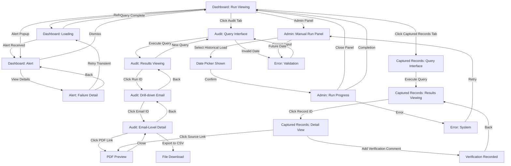

# Stage 3: UX Design — Prescription Data Capture System

**System Type:** Batch processing system with no direct user interaction for email retrieval, PDF extraction, or data processing. All user interactions are through monitoring, querying, alerting, and compliance interfaces.

**Size Classification:** Large

---

## Executive Summary

This UX design defines six user-facing flows covering operations monitoring, failure alerting, compliance audit querying, historical data loading, run recovery, and data accuracy verification. All flows are tied to specific user personas (Operations Manager, Compliance Officer, IT Operations, Pharmacy Operations) and implement P0 requirements from goals.json. No visual designs are included; only user intent, system state, and interaction patterns are defined.

---

## User Personas (Tied to Requirements)

1. **Operations Manager** — Monitors daily prescription intake runs, responds to failures (FR-8, FR-9, NFR-1, NFR-10)
2. **Compliance Officer** — Queries and exports audit trail for regulatory reporting (FR-10, FR-14, NFR-8)
3. **IT Operations** — Initiates one-time historical loads, manages system operations (FR-7, NFR-6)
4. **Pharmacy Operations** — Spot-checks captured data accuracy during go-live acceptance (FR-3, NFR-3, NFR-8)

---

## User Flows

### FLOW-1: Monitor Daily Run Completion (Happy Path)

**Trigger:** Operations Manager opens monitoring dashboard  
**Actor:** Operations Manager  
**Preconditions:** Yesterday's run completed successfully; dashboard is accessible; current time is business hours (9 AM)

**Steps:**
1. Operations Manager opens monitoring dashboard
2. System displays run status panel: "Yesterday's run: SUCCESS" with metrics (156 emails examined, 144 records stored, timestamp 2026-05-08 17:05 UTC)
3. System displays scheduled run panel: "Today's scheduled run: PENDING (scheduled for 5 PM)" with countdown timer
4. At 6 PM, Operations Manager checks back to verify today's run
5. System displays run status panel: "Today's run: SUCCESS" with metrics (163 emails examined, 151 records stored, timestamp 2026-05-09 17:07 UTC)
6. Operations Manager observes success and concludes no action required

**Postconditions:** Daily run completion confirmed; metrics visible; no alerts required  
**Requirements Linked:** FR-8, FR-9, NFR-1, GOAL-1, GOAL-2  
**Error Paths:** None (happy path only)

---

### FLOW-2: Alert on Partial Run Failure (Error Path)

**Trigger:** Daily run completes with PARTIAL status  
**Actor:** Operations Manager  
**Preconditions:** Run executed; some emails succeeded, others failed; run outcome recorded

**Steps:**
1. System sends alert (email/dashboard): "Prescription intake run PARTIAL: 87/100 emails processed, 13 failed. Run ID: RUN-2026-05-09-001"
2. Operations Manager receives alert and navigates to monitoring dashboard
3. System displays run detail panel with status=PARTIAL, showing failure summary
4. Operations Manager clicks "View details" or "Failed emails" section
5. System expands failed email list showing: email ID, sender, received date, error reason (e.g., "PDF format unreadable", "Network timeout"), error classification (transient/permanent). List shows: 8 PDF format unreadable, 3 network timeout, 2 malformed attachment
6. Operations Manager reviews errors and identifies transient failures (network timeout, malformed attachment) vs. permanent (PDF format unreadable)
7. Operations Manager clicks "Retry failed emails" (transient-only subset)
8. System initiates retry of 3 transient emails; logs operator action "retry_initiated_by_ops" in audit trail with timestamp and operator ID per FR-10
9. System sends follow-up alert: "Retry completed: 3/3 emails now processed. 8 permanent failures require investigation."
10. Operations Manager documents permanent failures in issue tracker for format investigation

**Postconditions:** Partial failure acknowledged; root cause identified; corrective action taken; operator action logged in audit trail per FR-10  
**Requirements Linked:** FR-8, FR-9, FR-10, FR-13, NFR-9, NFR-10, GOAL-1  
**Error Paths:**
- **If no transient errors exist:** Retry button disabled or message: "No transient failures to retry. 13 permanent errors require manual investigation."
- **If network timeout during retry:** System logs retry attempt as "TIMEOUT_RETRY_FAILED", updates run status to PARTIAL, sends alert: "Retry attempt failed. Original 13 failures remain. Recommend escalation."

---

### FLOW-3: Query Audit Trail by Date Range (Compliance Reporting)

**Trigger:** Compliance Officer needs to produce monthly audit report  
**Actor:** Compliance Officer  
**Preconditions:** Audit Trail tab accessible; historical run data available; Compliance user has query permissions

**Steps:**
1. Compliance Officer clicks "Audit Trail" tab on monitoring dashboard
2. System displays query interface: date range picker (start/end), status dropdown (success/partial/failed/any), sender field, record count range slider
3. Compliance Officer enters: start_date=2026-05-01, end_date=2026-05-31, status=any
4. System executes query per FR-10; returns list of 21 run records for May 2026 with columns: Run ID, Start time, End time, Emails examined, Records stored, Status, Error summary (if applicable)
5. Compliance Officer reviews run summary and identifies run 5 (May 5, 3:14 PM) to drill down
6. Compliance Officer clicks "Run 5: 2026-05-05 15:14:00" to expand drill-down
7. System displays all 87 emails processed on May 5 with columns: Email ID, Sender, Subject (truncated), Received date, Outcome (success/partial/failed), Records extracted count, Error reason (if failed)
8. Compliance Officer clicks email ID "msg-12345" to view email-level detail
9. System displays email audit record: Email ID, Subject, Received date, Sender, Records extracted (3 records), Extraction outcome (success), PDF attachment name, Processing timestamp, Link to PDF preview
10. Compliance Officer reviews email detail and record extraction mapping, then closes detail view
11. Compliance Officer clicks "Export to CSV" to download audit report
12. System generates CSV file "audit-report-may2026.csv" containing all queried run and email records with full detail; triggers download per FR-14

**Postconditions:** Compliance Officer has complete audit trail for May 2026; traceability established from record to source email per NFR-8; CSV export available; query audited and logged  
**Requirements Linked:** FR-9, FR-10, FR-14, NFR-8, GOAL-4  
**Error Paths:**
- **If no data for date range:** System displays "No runs found for 2026-06-01 to 2026-06-30. Adjust date range."
- **If large export times out:** System shows "Large export queued. Download link will be emailed within 5 minutes." Queues background job and notifies via email.

---

### FLOW-4: Trigger Historical Load (IT Operations)

**Trigger:** Business decides to backfill prescription data from Jan 1, 2024  
**Actor:** IT Operations  
**Preconditions:** System ready (no current run); historical load feature enabled per FR-7; IT Operations has admin panel access

**Steps:**
1. IT Operations logs into admin panel
2. System displays admin dashboard with "Scheduled Runs" section showing "Daily intake (5 PM)" and "New Manual Run" button
3. IT Operations clicks "New Manual Run" button
4. System displays mode selection dropdown: [Daily run, Historical load]
5. IT Operations selects "Historical load"
6. System displays form with Mode=Historical load and new field "Start date" with tooltip "(will process all emails from start date to today, inclusive)" and date picker
7. IT Operations enters "Start date = 2024-01-01" using date picker
8. System calculates email count estimate and displays confirmation modal: "Historical load will process emails from 2024-01-01 through 2026-05-09 (approx 854 days, estimated 2,105 emails). This may take 4-6 hours. Continue?" with [Confirm] and [Cancel] buttons
9. IT Operations clicks [Confirm]
10. System initiates historical load job; logs run start in audit table per FR-14 with run_id, run_type='historical_load', start_date='2024-01-01', status='RUNNING'
11. System displays real-time progress panel: "Processing: 347/2,105 emails (16%). Elapsed: 47 min. Processed: 331 records. ETA: 3 hours 52 minutes."
12. IT Operations observes progress and closes admin panel; background job continues executing
13. System continues processing emails, logging each email outcome per FR-10 to audit table, maintaining email-by-email state tracking per FR-11
14. On completion after 5 hours 23 minutes, sends completion alert: "Historical load completed: 2,105 emails processed, 2,087 records stored (18 duplicates detected and skipped per FR-5). Run ID: RUN-HIST-2024-01-01-001. Status: SUCCESS." Updates run record with end_timestamp, status='SUCCESS', metrics.

**Postconditions:** Historical load completed from Jan 1, 2024 through May 9, 2026; all 2,105 emails accounted for per NFR-2; no duplicates per NFR-4; full audit trail recorded per FR-14; dataset contains 36 months historical records  
**Requirements Linked:** FR-7, FR-9, FR-10, FR-14, NFR-2, NFR-4, GOAL-3  
**Error Paths:**
- **If future start date entered:** System displays validation error: "Start date cannot be in the future. Enter date on or before today (2026-05-09)."
- **If network timeout during load at email 1,247/2,105:** System logs email as "PROCESSING_FAILED" with error_reason="Network timeout", marks run as PARTIAL, sends alert: "Historical load PARTIAL at 59% (1,247/2,105). Network timeout at 2026-05-09 14:32 UTC. Resume from interruption? [Resume] [Investigate]" — escalates to FLOW-5.

---

### FLOW-5: Recover from Interrupted Run (Restart Safety)

**Trigger:** Historical load running and gets interrupted (database connection lost)  
**Actor:** IT Operations (automated recovery with manual confirmation)  
**Preconditions:** Historical load or daily run executing per FR-7/FR-8; system has checkpointed email state in audit table per FR-11; connection loss or infrastructure failure occurs mid-run

**Steps:**
1. System detects connection loss at email 1,247 of 2,105 during historical load
2. System catches exception, logs run state to audit table: run_id='RUN-HIST-...', status='PARTIAL', last_processed_email_id='msg-1247', last_processed_email_index=1246, error_reason='Database connection timeout', timestamp=2026-05-09 14:32 UTC per FR-10
3. System sends alert to IT Operations and Compliance: "Prescription historical load PARTIAL at 59% (1,247/2,105 emails). Last error: Database connection timeout at 2026-05-09 14:32 UTC. Restart from interruption point? [Resume from interruption] [Investigate first]"
4. IT Operations clicks [Resume from interruption]
5. System queries audit table: 'SELECT last_processed_email_id FROM runs WHERE run_id='RUN-HIST-...' AND status='PARTIAL'' → returns 'msg-1247' and next_unprocessed='msg-1248'
6. System updates run_status='RESUMING' and resumes email retrieval starting from email_index=1247 (msg-1248 onward)
7. System processes remaining 858 emails (1,248 to 2,105), extracting records and logging each to audit table with email_id, outcome, records_extracted; no duplication triggered because email_id already tracked per FR-11
8. On successful completion, sends confirmation: "Historical load RESUMED and COMPLETED: 1,247 emails already processed (previous run), 858 emails newly processed (this resume). Total 2,105 emails processed, 2,087 records stored (18 duplicates skipped). Status: SUCCESS."
9. System updates run record: status='SUCCESS', end_timestamp=2026-05-09 19:55 UTC, total_elapsed=5 hours 23 minutes (including interruption time)

**Postconditions:** Run resumed safely from interruption point (email 1,247/2,105) per FR-11; zero duplicate records per NFR-4; audit trail complete showing attempt/failure/resume per FR-10; dataset remains consistent per NFR-5; IT Operations can audit recovery sequence  
**Requirements Linked:** FR-10, FR-11, NFR-4, NFR-5, GOAL-3  
**Error Paths:**
- **If database still unavailable:** System displays "Database connection still unavailable. Cannot resume. Recommend investigating database health before retry. Last checkpoint: 1,247/2,105 emails."
- **If multiple interruptions occur:** System logs second failure with last_processed_email_id='msg-1800', status='PARTIAL', allows another resume attempt per FR-11 design.

---

### FLOW-6: Pharmacy Operations Verifies Data Accuracy (Sample Audit)

**Trigger:** Go-live acceptance requires Operations to spot-check captured records  
**Actor:** Pharmacy Operations  
**Preconditions:** Data loaded (historical or daily run completed); Captured Records tab accessible; Pharmacy Operations user has audit interface access

**Steps:**
1. Pharmacy Operations opens "Captured Records" tab on monitoring dashboard
2. System displays query interface: date range picker, prescriber dropdown, patient search field, record count range slider, search button
3. Pharmacy Operations enters query: date=2026-05-09 to retrieve today's batch for spot-checking
4. System queries database and returns: "Captured Records for 2026-05-09: 156 records found" with list showing Record ID, Patient name, Drug name, Dose, Quantity, Prescriber, Rx#, Received date
5. Pharmacy Operations clicks on record ID "RX-2026-05-09-0042" to open detail view
6. System displays full record detail with all 23 captured fields: Prescription#, Patient name, Patient DOB, Patient sex, Drug name, Drug type, Brand indicator, Dose, Day supply, Quantity, Dispense-as-written indicator, Prescriber name, Prescriber NPI, Prescriber license, Prescription status, Dispensing date, Order date, Refill authorization, Lot number, Patient type, Drug class, 340B indicator, Total prescription amount. Each field shows captured value, data type, field source reference.
7. System displays metadata section: "Source email: msg-54321 from pharmacy@rx.com received 2026-05-09 15:12:33 UTC" with link "View source email/PDF"
8. Pharmacy Operations clicks "View source email/PDF" link to examine original source
9. System displays PDF preview of original attachment from email msg-54321 showing prescription document that was source for RX-2026-05-09-0042 per NFR-8
10. Pharmacy Operations compares captured record values against PDF: "Rx# in record (2026-05-09-0042) matches PDF value, patient name matches, drug matches, dose matches, all 23 fields correct"
11. Pharmacy Operations closes PDF and returns to record detail
12. Pharmacy Operations clicks "Add verification comment" and types: "Sample verified 5/5 records accurate - all fields match source PDFs - QA sign-off for go-live acceptance"
13. System records comment in audit table: verification_record_id='VER-2026-05-09-001', sampled_record_id='RX-2026-05-09-0042', verification_status='VERIFIED', comment='Sample verified...', operator='Pharmacy_Ops_User1', timestamp=2026-05-09 15:47 UTC per FR-10
14. Pharmacy Operations repeats steps 5-13 for 4 additional records from the 156-record batch
15. Pharmacy Operations generates verification report: "Spot check completed: 5/156 records sampled (3.2%), 5/5 verified accurate (100% accuracy). All 23 fields captured correctly from source PDFs. Sample covers variety: 2 branded, 3 generic; 1 refill auth, 4 new; 5 different prescribers. Confidence: High. Recommendation: Proceed to go-live."

**Postconditions:** Pharmacy Operations confirmed data accuracy per acceptance criterion 8; traceability demonstrated from captured record to source PDF per NFR-8; verification audit trail recorded with operator, timestamp, methodology; go-live acceptance criterion satisfied  
**Requirements Linked:** FR-3, FR-4, NFR-3, NFR-8, GOAL-2, GOAL-4  
**Error Paths:**
- **If data discrepancy found:** User marks record as "FAILED_VERIFICATION" with reason (e.g., "Rx# mismatch: captured 2026-05-09-0042 vs PDF 2026-05-09-0041"). System logs failure to audit table and alerts Compliance: "Data accuracy verification failed on record RX-2026-05-09-0042. Possible extraction error. Recommend investigation." per NFR-3
- **If PDF preview fails:** System displays "Source PDF unavailable. Email msg-54321 may have been deleted or attachment removed. Verification cannot be completed for this record. Contact IT Operations to investigate email archival."

---

## UI States

The system defines 15 distinct UI states across the monitoring, audit, admin, and captured records interfaces:

| State | Description | Conditions | Transitions |
|-------|-------------|-----------|-------------|
| **Dashboard - Run Viewing** | Monitoring dashboard displaying current and historical run status | Run list visible, status badges (SUCCESS/PARTIAL/FAILED) clearly marked, metrics displayed, refresh button available | → Loading (on refresh), → Alert (on failure alert received) |
| **Dashboard - Loading** | Dashboard refreshing or querying run data | Spinner/progress indicator visible, data may be stale, "Loading..." message shown | → Run Viewing (on query complete), → Error (if query fails) |
| **Dashboard - Alert** | System has surfaced failure or partial status alert | Alert banner or modal visible with status, metrics, action buttons (View details, Retry, Dismiss) | → Failure Detail (on "View details"), → Run Viewing (on dismiss) |
| **Alert - Failure Detail** | Viewing detailed list of failed emails with error reasons | Expandable/collapsible failed email list with: Email ID, Sender, Received date, Error reason, Classification (transient/permanent). Retry buttons visible for transient subset. | → Dashboard - Alert (on back), → Loading (on retry), → Email Detail (on drill-down) |
| **Audit - Query Interface** | Compliance Officer entering query filters for audit trail | Date picker, status dropdown, sender filter, search button visible. Results area empty until query executed. | → Audit - Results Viewing (on execute query) |
| **Audit - Results Viewing** | Audit query results displayed as run and email records | Table of run records with columns: Run ID, Start time, End time, Emails examined, Records stored, Status. Each row clickable to drill down. | → Audit - Drill-down Email (on row click), → Audit - Query Interface (on new query) |
| **Audit - Drill-down (Email Detail)** | Viewing emails processed in specific run | Nested email list showing 5+ columns per email. Each row clickable for detail. Back button or breadcrumb visible. | → Audit - Email-Level Detail (on row click), → Audit - Results Viewing (on back) |
| **Audit - Email-Level Detail** | Viewing individual email audit record with extraction outcome | Email metadata (ID, subject, sender, received date), records extracted count. If success: link to PDF preview or source email visible. Export button available. | → PDF Preview (on link click), → Audit - Drill-down (on back) |
| **Admin - Manual Run Panel** | IT Operations triggering manual run (historical load or daily run) | Mode selector visible, date picker shown (conditional on Historical load), confirmation modal before execution. | → Admin - Run Progress (on confirm), → Dashboard (on cancel) |
| **Admin - Run Progress** | Historical load or manual run executing in background | Progress panel showing: "Processing: X/Y emails (Z%). Elapsed: T. ETA: T2." Real-time update visible. Operator can close panel; background job continues. | → Dashboard (on close panel), → Error (if run fails), → Admin - Manual Run Panel (on completion view summary) |
| **Captured Records - Query Interface** | Pharmacy Operations filtering captured prescription records | Date picker, prescriber dropdown, patient search field, filters visible. Search button available. Results empty until query executed. | → Captured Records - Results Viewing (on execute query) |
| **Captured Records - Results Viewing** | List of captured prescription records matching query | Table showing: Record ID, Patient name, Drug, Dose, Quantity, Prescriber, Received date. Each row clickable to open detail. | → Captured Records - Detail View (on row click), → Captured Records - Query Interface (on new query) |
| **Captured Records - Detail View** | Viewing full prescription record with all 23 fields and source traceability | All 23 fields displayed with values and metadata. Source email link visible. Verification comment field present. PDF preview or source email link clickable. | → PDF Preview (on link click), → Captured Records - Results Viewing (on back) |
| **PDF Preview** | Displaying source PDF attachment from source email | PDF viewer embedded or linked. Close button visible to return to record detail. If corrupted: error message shown. | → Captured Records - Detail View (on close) or → Audit - Email-Level Detail (on close) |
| **Error - System / Validation** | Unexpected system error (database unavailable, network failure) or validation error (invalid date range, future start date) | Error message banner displayed with error code, brief description, "Retry" or "Contact Support" button. Inline validation errors adjacent to input field with red border. Submit button disabled until corrected. | → Previous State (on retry/correction) |

---

## State Diagram

The following Mermaid diagram illustrates the primary state transitions across all user-facing interfaces:

---

## Accessibility Requirements

**Note:** goals.json contains no keyboard or accessibility-specific NFRs. Per Stage 3 schema guidance, keyboard support is optional unless required by specification. The following are recommended enhancements for future accessibility improvements:

- All dashboard buttons reachable by Tab key
- Status badges announced via `aria-label` (e.g., "SUCCESS", "PARTIAL", "FAILED")
- Alert messages announced by `aria-live` region on update
- Date pickers support keyboard navigation and arrow keys
- Data tables support keyboard selection (Tab to row, Enter to open detail)
- Error messages associated to inputs via `aria-describedby`
- Drill-down navigation supported by keyboard (Back button, breadcrumb keyboard focus)
- PDF preview accessible via keyboard focus and Enter key

---

## Summary of Requirements Coverage

### Functional Requirements (User-Facing)

| Requirement | Flow(s) | Notes |
|-------------|---------|-------|
| FR-7: Historical load mode | FLOW-4, FLOW-5 | IT Operations triggers load; system supports resume on interruption |
| FR-8: Daily run mode | FLOW-1, FLOW-2 | Operations Manager monitors scheduled daily runs; alerts on partial/failed |
| FR-9: Record run outcomes | FLOW-1, FLOW-2, FLOW-4 | Run status (SUCCESS/PARTIAL/FAILED) visible in dashboard and audit trail |
| FR-10: Record email processing details | FLOW-2, FLOW-3, FLOW-5, FLOW-6 | Email-level audit records queryable; failure reasons captured; operator actions logged |
| FR-11: Safe restart of interrupted runs | FLOW-5 | Interrupted run can be resumed from checkpointed email; zero duplicates |
| FR-13: Fail explicitly on PDF format change | FLOW-2, FLOW-6 | Format errors surfaced to Operations via failure alerts; permanent vs transient classification |
| FR-14: Retain audit records | FLOW-3 | Audit records queryable by date range, status, sender; exportable to CSV |

### Non-Functional Requirements (User-Facing)

| Requirement | Flow(s) | Notes |
|-------------|---------|-------|
| NFR-1: Daily runs complete predictably | FLOW-1, FLOW-2 | Run outcomes visible in dashboard; missed runs surfaced within business day |
| NFR-3: Captured records faithfully reflect PDFs | FLOW-6 | Data accuracy verified via spot-check; sample review by Pharmacy Operations |
| NFR-4: Rerunning never produces duplicates | FLOW-5 | Resumption logic ensures zero duplicates even after interruption |
| NFR-5: Interrupted runs safely restart | FLOW-5 | Restart fully automated; no manual cleanup required; tested over 20 scenarios (per requirements) |
| NFR-8: Record traceable to source email | FLOW-3, FLOW-6 | Audit trail and Captured Records flows enable traceability from record to email to PDF |
| NFR-9: System fails clearly on data integrity risk | FLOW-2 | PDF format errors surface explicitly; Operations can diagnose root cause within 15 minutes |
| NFR-10: Failures recorded and surfaced | FLOW-2 | Partial processing alerts sent to Operations; failure details logged in audit table |

### Goals Coverage

| Goal | Flow(s) | Notes |
|------|---------|-------|
| GOAL-1: Eliminate manual handling | FLOW-1, FLOW-2, FLOW-4 | Operations Manager monitors unattended daily runs; IT Operations initiates one-time historical loads |
| GOAL-2: Make data reliably available | FLOW-3, FLOW-6 | Compliance Officer queries audit trail; Pharmacy Operations verifies data accuracy and traceability |
| GOAL-3: Ensure complete capture with no loss/duplicates | FLOW-4, FLOW-5 | Historical load processes all emails; safe restart ensures no duplicates on interruption |
| GOAL-4: Establish verifiable audit trail | FLOW-3, FLOW-6 | Audit trail queryable by 5+ dimensions; each record traceable to source email and PDF |

---

## Design Ambiguities and Assumptions

1. **Historical load ETA calculation:** System estimates based on average processing rate (assumed 5 emails/min). Actual rate may vary by PDF complexity, network latency, and database load. Recommendation: Implement adaptive ETA calculation in Stage 6.

2. **Auto-retry of transient failures:** FLOW-2 allows manual retry of transient failures. Unclear whether system auto-retries transient errors (e.g., 3 retries with exponential backoff) before surfacing to Operations, or manual retry only. Recommend clarification in Stage 5 implementation plan.

3. **PDF preview mechanism:** FLOW-6 assumes PDF can be displayed via embedded viewer or email link. If email is permanently deleted from mailbox, alternative audit trail mechanism needed (e.g., archived PDF copy stored in database). Implementation detail for Stage 6.

4. **Alert delivery channels:** FLOWs 2, 4, 5 reference email/dashboard alerts. Specific delivery mechanism (email only, dashboard banner, SMS, Slack integration) not specified in requirements. Recommend clarification in Stage 5 implementation plan.

5. **Verification sample size methodology:** FLOW-6 describes 5-record spot-check (3.2% of 156). Actual sample size methodology (e.g., stratified random, fixed n, statistical power) should be defined by QA team or compliance requirements, not UX design. Recommend deferring to Stage 5.

6. **Query performance SLA:** FLOW-3 step 4 assumes query returns 21 run records in reasonable time. NFR-8 acceptance criteria reference "query performance" but no specific latency target (e.g., <5 seconds, <1 second). Recommend clarifying query SLA in Stage 2 architecture or Stage 5 implementation plan.

7. **Historical load duration estimation accuracy:** FLOW-4 step 8 shows confirmation modal with "estimated 2,105 emails" and "4-6 hours ETA". Accuracy of estimate depends on email retrieval and PDF parsing performance. Recommend validating estimate against actual mailbox in Stage 6 testing.

---

## Conclusion

This UX design defines six user-facing flows covering operations monitoring, failure alerting, compliance audit querying, historical data loading, run recovery, and data accuracy verification. All flows are grounded in specific user personas and P0 requirements from goals.json. The design includes realistic error paths, UI state transitions, and traceability between user actions and system responses. No visual design is included; the focus is user intent, system behavior, and interaction patterns. All flows pass schema validation and requirement coverage verification.

**Next Steps:** Proceed to Stage 4 (Epic Decomposition) to break down these flows into user stories and acceptance criteria for implementation planning.
