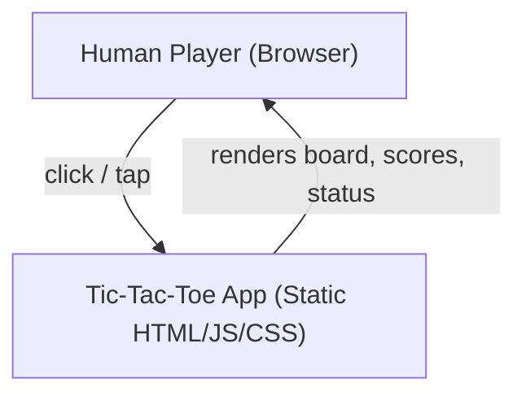
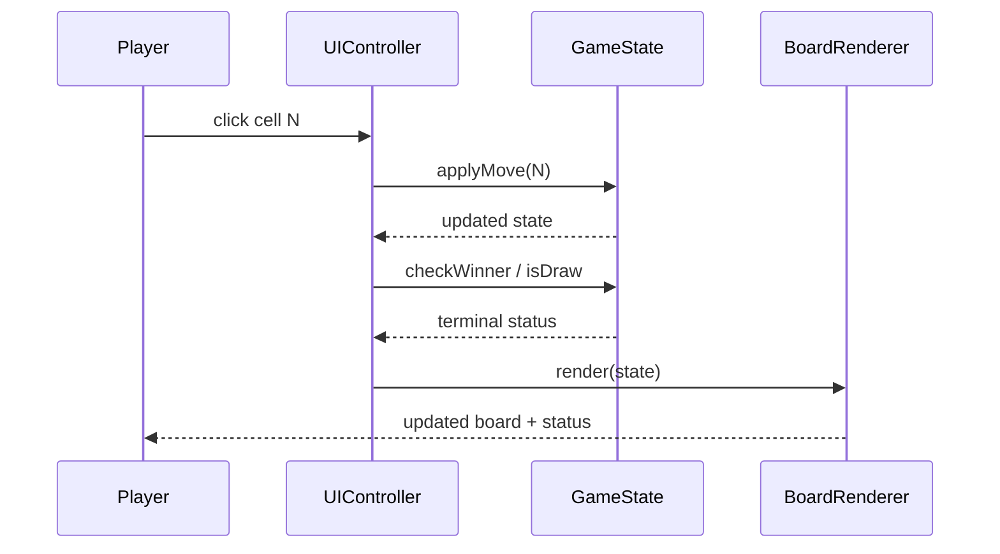
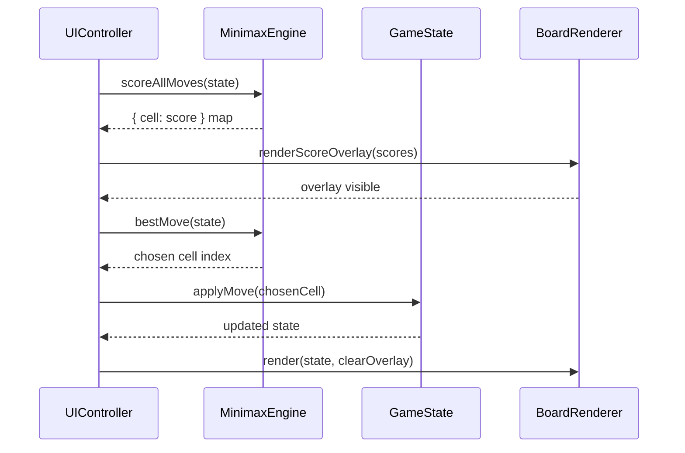

# Architecture: Tic-Tac-Toe with Unbeatable AI

**Status:** Draft
**Author:** [TBD]
**Date:** May 5, 2026
**Version:** 1.0
**Related PRD:** `prd_final.md`

---

## 1. Overview

A fully client-side, single-page Tic-Tac-Toe application delivered as static HTML/CSS/JavaScript with no build toolchain or server dependency. The application hosts three play modes (PvP, Easy AI, Impossible AI), a minimax engine with alpha-beta pruning, and a score overlay that renders each open cell's minimax evaluation during the Impossible AI's turn. All logic runs in the browser.

---

## 2. Goals & Non-Goals

### Goals
- Pure client-side execution — no server, no network calls after initial load.
- Correct minimax with alpha-beta pruning that provably never loses.
- Score overlay computed independently of the alpha-beta move selection to guarantee accuracy.
- Clear separation between game logic, AI engine, and UI rendering so each layer is independently testable.

### Non-Goals
- Server-side logic, persistence, or multi-user networking.
- Stretch-goal variants (Ultimate Tic-Tac-Toe, 4×4/5×5 grids, teaching mode).
- Framework dependencies (React, Vue, etc.) — vanilla JS is sufficient and keeps the reference implementation portable.

---

## 3. System Context

The entire application runs inside the user's browser. There are no external systems.

---

## 4. Component Design

| Component | Responsibility | Layer |
|-----------|---------------|-------|
| `GameState` | Holds the canonical board array (9 cells), current player, game mode, and terminal status. Exposes pure functions: `applyMove`, `checkWinner`, `isDraw`, `getLegalMoves`. | Domain / Logic |
| `MinimaxEngine` | Implements minimax with alpha-beta pruning. Exposes `bestMove(state)` and `scoreAllMoves(state)`. `scoreAllMoves` uses plain minimax (no alpha-beta) to guarantee accurate per-cell scores. | AI Engine |
| `EasyAI` | Picks a random legal move from `GameState.getLegalMoves()`. | AI Engine |
| `UIController` | Listens for user events, calls `GameState` and AI engine, drives `BoardRenderer` updates. Manages mode selection, new-game flow, and turn indication. | UI / Controller |
| `BoardRenderer` | Writes DOM — renders the 3×3 grid, X/O symbols, score overlays, winning-line highlight, and game-over banner. Contains no business logic. | UI / View |

---

## 5. Data Flow

### Human move (any mode)

### Impossible AI turn

Note: `scoreAllMoves` runs plain minimax (no alpha-beta) to guarantee that each cell's displayed score is the true minimax value. `bestMove` runs minimax with alpha-beta for speed but uses the same scores to select the move.

---

## 6. Data Model

| Entity | Fields | Notes |
|--------|--------|-------|
| `Board` | `cells: (null\|'X'\|'O')[9]` | Index 0–8, row-major. `null` = empty. |
| `GameMode` | `'pvp' \| 'easy' \| 'impossible'` | Enum / string constant |
| `Player` | `'X' \| 'O'` | X always moves first |
| `TerminalStatus` | `{ over: bool, winner: 'X'\|'O'\|null, line: number[]\|null }` | `line` holds the three winning cell indices; `null` if draw or ongoing |
| `ScoreMap` | `{ [cellIndex: number]: number }` | Only open cells included; scores in range [−1, 0, +1] |

All state is ephemeral in-memory JavaScript — no localStorage, no IndexedDB.

---

## 7. API / Interface Design

Internal module interfaces (no network API):

| Function | Signature | Description |
|----------|-----------|-------------|
| `applyMove(state, cellIndex)` | `(GameState, number) → GameState` | Returns new state with move applied. Throws if cell occupied or game over. |
| `checkWinner(cells)` | `(cells) → TerminalStatus` | Checks all 8 win lines. O(1). |
| `getLegalMoves(state)` | `(GameState) → number[]` | Returns indices of empty cells. |
| `bestMove(state)` | `(GameState) → number` | Returns cell index of best move via minimax + alpha-beta. |
| `scoreAllMoves(state)` | `(GameState) → ScoreMap` | Returns minimax score for every legal move (no alpha-beta). |

---

## 8. Infrastructure & Deployment

- **Deployment target:** Any static file host (GitHub Pages, Netlify, local filesystem).
- **Build:** None required. A single `index.html` with inline or co-located JS/CSS is sufficient for v1.
- **Dependencies:** Zero runtime dependencies. Optional: a test runner (e.g., Vitest or plain Node test) for the AI engine unit tests.
- **Browser support:** Latest stable Chrome, Firefox, Safari. No IE/legacy support required.

---

## 9. Security & Privacy Considerations

- **No user data collected.** The game has no accounts, no input fields beyond cell clicks, and no network calls.
- **No authentication/authorization surface.**
- **No PII.** All state is transient in-memory JavaScript.
- **XSS:** `BoardRenderer` must not use `innerHTML` with any user-controlled string. Cell content (`X`, `O`, numeric scores) is written as `textContent` only.

---

## 10. Scalability & Performance

- **Expected load:** Single user, single browser tab. No concurrency concerns.
- **Minimax tree size:** 3×3 Tic-Tac-Toe has at most 9! = 362,880 leaf nodes before pruning. With alpha-beta and memoization, the effective tree is tiny — well under 50 ms on any modern device.
- **Score overlay computation:** `scoreAllMoves` runs at most 9 minimax calls (one per open cell). Combined, these are negligible.
- **Caching:** Optional transposition table (memoize `checkWinner` results keyed on board state string) can further reduce computation, but is not required given the small tree size.

---

## 11. Observability

This is a client-side game with no infrastructure to observe. Recommended developer-facing practices:

- **Unit tests:** `GameState` and `MinimaxEngine` should have full unit test coverage. The test suite is the primary quality signal.
- **Console errors:** `UIController` should log unexpected state transitions to `console.error` in development builds.
- **No production logging, metrics, or alerting** — not applicable for a static game.
