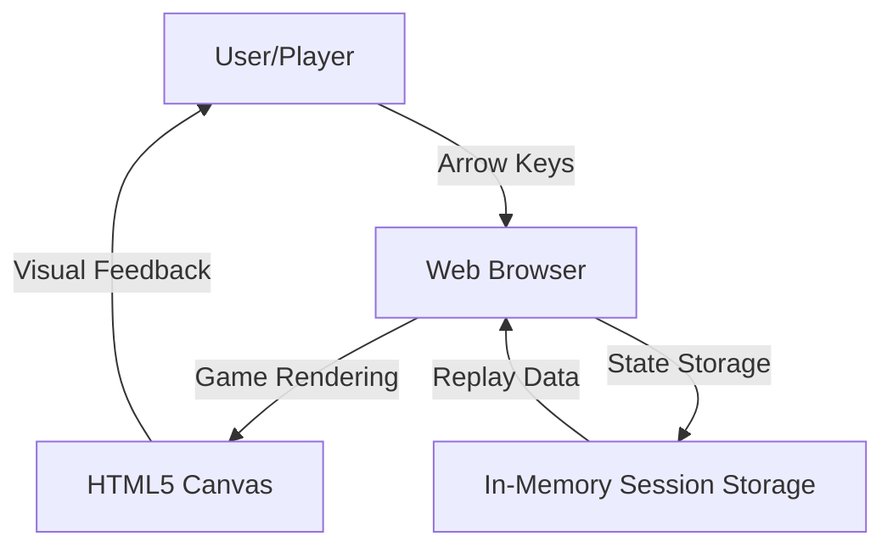
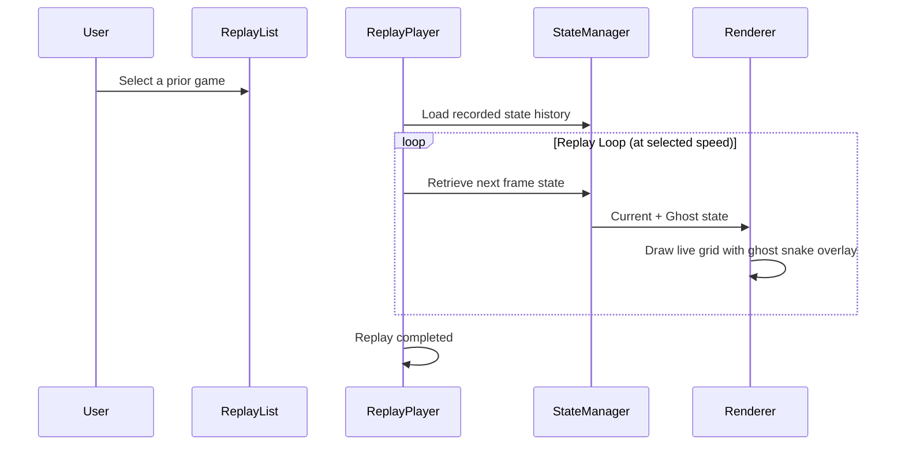

# Architecture: Snake with Replay System

**Status:** Draft  
**Author:** SDLC Pipeline  
**Date:** May 6, 2026  
**Version:** 1.0  
**Related PRD:** [prd_final.md](prd_final.md)

---

## 1. Overview
A browser-based Snake game implemented in vanilla JavaScript with HTML5 Canvas rendering. The system records all game states during play, enabling bit-exact replay playback at variable speeds. The architecture separates game logic, state management, replay recording/playback, rendering, and input handling into distinct modules to ensure deterministic behavior, accurate replay fidelity, and clean separation of concerns.

---

## 2. Goals & Non-Goals

### Goals
- Enable **deterministic replay:** Same input sequence must always produce identical game states
- Support **simultaneous live and replay gameplay:** Ghost snake (replay) and live snake coexist on one grid without interference
- Achieve **clean architecture:** Game logic independent of rendering and I/O for testability
- Provide **variable replay speeds:** Playback at 0.5×, 1×, 2×, 4× without losing frame accuracy
- Ensure **input safety:** Rapid directional input cannot cause snake to reverse direction mid-move

### Non-Goals
- Server-side persistence or multiplayer
- Optimization for very large grids (20×20 is target)
- AI or advanced pathfinding
- Audio/visual effects beyond basic rendering

---

## 3. System Context

The application runs entirely in the browser. Users interact via keyboard (arrow keys), the canvas displays the game state, and all state is retained in memory during the session.



---

## 4. Component Design

| Component | Responsibility | Technology / Layer |
|-----------|---------------|-------------------|
| **InputManager** | Capture arrow key presses, buffer rapid inputs, prevent direction reversal | Event listeners, input queue |
| **GameEngine** | Game loop, move snake, grow snake, detect collisions, manage food | Core logic |
| **StateManager** | Maintain current game state, serialize/deserialize for replay, record all frames | In-memory state object |
| **ReplayRecorder** | Capture each frame's state and input sequence during live play | Extends StateManager |
| **ReplayPlayer** | Playback recorded states at variable speeds, manage ghost snake rendering | Playback mode controller |
| **Renderer** | Draw game grid, snake (live and ghost), food, score, UI | Canvas 2D context |
| **GameController** | Orchestrate all components, manage game lifecycle (play/pause/end) | Main coordinator |
| **ReplayList** | Maintain list of completed games, allow selection for playback | Session-level registry |

---

## 5. Data Flow

### Live Game Flow

```mermaid
sequenceDiagram
    participant User
    participant InputManager
    participant GameEngine
    participant StateManager
    participant ReplayRecorder
    participant Renderer
    
    loop Game Loop (e.g., 60 FPS)
        User->>InputManager: Arrow key press
        InputManager->>InputManager: Check for reversal; buffer input
        InputManager->>GameEngine: Valid direction
        GameEngine->>StateManager: Update snake position
        GameEngine->>StateManager: Check collision
        GameEngine->>StateManager: Spawn food if eaten
        StateManager->>ReplayRecorder: Record current frame state
        StateManager->>Renderer: Current state
        Renderer->>Renderer: Draw grid, snake, food, score
    end
    
    GameEngine->>GameEngine: Collision detected
    GameEngine->>GameController: Game over
    ReplayRecorder->>ReplayList: Save completed game
```

### Replay Playback Flow



### Simultaneous Play & Replay Flow

```mermaid
sequenceDiagram
    participant User
    participant ReplayPlayer
    participant LiveGame
    participant Renderer
    
    User->>ReplayPlayer: Start replay while live game running
    
    loop Each frame
        ReplayPlayer->>ReplayPlayer: Advance ghost snake frame
        LiveGame->>LiveGame: Advance live snake frame
        ReplayPlayer->>Renderer: Ghost state
        LiveGame->>Renderer: Live state
        Renderer->>Renderer: Draw both; live collision logic ignores ghost
    end
```

---

## 6. Data Model

### Game State Object (Serializable)

| Field | Type | Description |
|-------|------|-------------|
| `gridWidth` | number | Game grid width (20) |
| `gridHeight` | number | Game grid height (20) |
| `snakeBody` | array of `{x, y}` | Snake segments from head to tail |
| `foodPos` | `{x, y}` | Current food position |
| `score` | number | Points earned |
| `speed` | number | Current movement speed (pixels/frame or ticks/frame) |
| `direction` | enum | Current direction (UP, DOWN, LEFT, RIGHT) |
| `nextDirection` | enum | Buffered next direction |
| `gameOver` | boolean | Whether game has ended |
| `frameCount` | number | Total frames elapsed in game |

### Recorded Game (Replay) Structure

| Field | Type | Description |
|-------|------|-------------|
| `id` | string | Unique identifier (timestamp or UUID) |
| `timestamp` | number | Unix timestamp when game started |
| `gridWidth`, `gridHeight` | number | Grid dimensions at start |
| `frameHistory` | array of state objects | Complete state snapshot for each frame |
| `inputHistory` | array of inputs | Sequence of directional inputs (for audit) |
| `finalScore` | number | Score when game ended |
| `totalFrames` | number | Total frames in recorded game |

### Ghost Snake (Replay Overlay) Representation

| Field | Type | Description |
|-------|------|-------------|
| `currentFrameIndex` | number | Which frame in frameHistory is currently displayed |
| `playbackSpeed` | number | Multiplier (0.5, 1, 2, 4) |
| `isPlaying` | boolean | Whether replay is actively running |
| `snakeBody` | array of `{x, y}` | Ghost snake body for current frame |

---

## 7. API / Interface Design

### GameEngine Public Methods

| Method | Description | Parameters | Returns |
|--------|-------------|-----------|---------|
| `start()` | Initialize new game | None | void |
| `tick()` | Execute one game frame | None | void |
| `setDirection(dir)` | Queue a direction change | `dir: "UP"/"DOWN"/"LEFT"/"RIGHT"` | void |
| `getState()` | Return current game state | None | GameState object |
| `isGameOver()` | Check if collision occurred | None | boolean |

### ReplayRecorder Public Methods

| Method | Description | Parameters | Returns |
|--------|-------------|-----------|---------|
| `startRecording()` | Begin capture (called at game start) | None | void |
| `recordFrame()` | Save current state snapshot | gameState: GameState | void |
| `stopRecording()` | End capture and finalize | None | ReplayData object |

### ReplayPlayer Public Methods

| Method | Description | Parameters | Returns |
|--------|-------------|-----------|---------|
| `loadReplay(replayData)` | Load a recorded game | replayData: ReplayData | void |
| `play()` | Start playback | None | void |
| `pause()` | Pause playback | None | void |
| `setSpeed(multiplier)` | Set playback speed | multiplier: 0.5 / 1 / 2 / 4 | void |
| `getCurrentFrameState()` | Get ghost snake state for rendering | None | GameState object |

### InputManager Public Methods

| Method | Description | Parameters | Returns |
|--------|-------------|-----------|---------|
| `onKeyDown(keyCode)` | Handle key press event | keyCode: number | void |
| `getBufferedDirection()` | Peek at next queued direction | None | direction string or null |

### Renderer Public Methods

| Method | Description | Parameters | Returns |
|--------|-------------|-----------|---------|
| `drawFrame(liveState, ghostState?)` | Render one frame | liveState: GameState, ghostState?: GameState | void |
| `setCanvas(canvasElement)` | Bind rendering target | canvasElement: HTMLCanvasElement | void |

---

## 8. Infrastructure & Deployment

### Environment
- **Client-side only:** No backend server required.
- **Runtime:** Modern web browsers (Chrome 90+, Firefox 88+, Safari 14+, Edge 90+).
- **Hosting:** Static file hosting (GitHub Pages, Netlify, Vercel, or equivalent).

### Build & Bundling
- **No build step required for MVP:** All code in vanilla JavaScript; served as static files.
- **Optional:** Minification for production (can use `esbuild` or equivalent if needed later).
- **Files:** 
  - `index.html` (main entry point)
  - `styles.css` (game styling)
  - `js/game-engine.js` (core game logic)
  - `js/input-manager.js` (keyboard input)
  - `js/state-manager.js` (state and serialization)
  - `js/replay-recorder.js` (recording)
  - `js/replay-player.js` (playback)
  - `js/renderer.js` (canvas rendering)
  - `js/game-controller.js` (orchestration)
  - `js/main.js` (initialization)

---

## 9. Security & Privacy Considerations

### Authentication/Authorization
- **Not applicable:** Single-player, client-side only; no user accounts or auth required.

### Data at Rest
- **Session only:** All replay data is stored in-memory during session; no persistent storage.
- **No sensitive data:** Game states contain only positions, scores, and directional inputs; no PII.

### Data in Transit
- **Not applicable:** No network requests; all computation local to browser.

### PII / Sensitive Data Handling
- None. Game does not collect, store, or transmit any personal information.

---

## 10. Scalability & Performance

### Expected Load
- Single-player, single-browser session; no concurrent users or multi-user scenarios.
- Grid size: 20×20 cells (400 cells max).
- Snake max length: ~300 segments (reasonable snake on 20×20 grid).
- Replays: Up to 10,000 frames per game is reasonable for a 5–10 minute session.

### Scaling Strategy
- **Not applicable:** Client-side only; no server resources to scale.
- If persistence is added later, consider caching frequently replayed games in localStorage.

### Caching
- **Game state:** Current state kept in memory; no caching layer needed for single game.
- **Replay data:** Loaded fully into memory; no lazy-loading required for MVP.

### Known Bottlenecks
- **Canvas rendering:** 60 FPS at 20×20 grid is well within browser capabilities.
- **Memory:** 10,000-frame replay ≈ ~100 KB (state snapshots are small); negligible memory footprint.
- **No identified bottlenecks for MVP.**

---

## 11. Observability

### Logging
- **Browser console:** Log game start, pause, resume, end, and replay events (can be toggled via debug flag).
- **Example:** `console.log("Game Over - Final Score:", score)`

### Metrics
- **Track:** Game duration, final score, replay plays, speeds selected.
- **Storage:** Track locally in session (optional console output for debugging).

### Alerts
- Not applicable (client-side only).

### Tracing
- **Input to output latency:** Measure time from key press to on-screen movement (target: <50ms).
- **Frame time:** Log rendering time to detect stuttering.

---

## 12. Dependencies & Risks

| Item | Type | Owner | Mitigation |
|------|------|-------|------------|
| Browser Canvas API | Dependency | Dev | Verify on target browsers; fallback not needed for MVP |
| Deterministic replay | Risk | Dev | Frozen random seed for food; unit test bit-exact accuracy |
| Input buffering correctness | Risk | Dev | Unit test 100+ two-key sequences; verify no reversals |
| Ghost/live collision isolation | Risk | Dev | Collision logic checks `isGhost` flag; tests verify no interference |
| Memory leaks on replay list | Risk | Dev | Limit replay list to last 50 games; implement cleanup |
| Canvas performance on low-end devices | Risk | Dev | Profile on Pixel 3a / iPhone SE; optimize draw calls if needed |

---

## 13. Open Questions & Assumptions

- **Assumption:** 20×20 grid is adequate for gameplay. Can increase post-MVP if desired.
- **Assumption:** 60 FPS game loop is sufficient; no need for adaptive frame rate.
- **Assumption:** In-memory replay storage is acceptable; no need for localStorage persistence in MVP.
- **Assumption:** No multiplayer or cross-device replay sharing in MVP.
- **Open question:** Should grid size be configurable? (Answer: No, fixed for MVP)
- **Open question:** Should we support URL-encoded replay sharing? (Answer: No, out of MVP scope)

---

## 14. Alternatives Considered

| Option | Pros | Cons | Decision |
|--------|------|------|----------|
| **Vanilla JS + Canvas** | Full control, minimal dependencies, small bundle | More manual state management | ✅ **Selected** |
| **Phaser.js / Babylon.js** | Built-in replay/recording features, physics | Overkill for Snake; larger bundle; less educational | ❌ Rejected |
| **Electron / NW.js** | Desktop app, file system access | Over-engineered; deployment complexity | ❌ Rejected |
| **Server-side state + WebSockets** | Real-time multiplayer capable | Unnecessary latency; complex infrastructure | ❌ Rejected |
| **State snapshots every 10 frames** | Reduced memory footprint | Lower replay fidelity; interpolation complexity | ❌ Rejected (full snapshots preferred) |
| **IndexedDB for persistence** | Persistent replays across sessions | Adds complexity; not needed for MVP | ❌ Rejected (in-memory only) |

---

## 15. Appendix

### Related Documents
- **PRD:** [prd_final.md](prd_final.md) — Product requirements and success metrics
- **Requirements:** [Requirements 1.md](Requirements%201.md) — Technical requirements and challenge areas
- **Expected Outcomes:** [Expected-Outcomes 1.md](Expected-Outcomes%201.md) — Acceptance criteria and correctness bar

### Technology Stack
- **Frontend:** HTML5, CSS3, Vanilla JavaScript (ES6+)
- **Rendering:** HTML5 Canvas 2D API
- **Hosting:** Static file host (GitHub Pages)
- **Development:** VS Code, browser DevTools

### Key Concepts
- **Game Loop:** Fixed-tick game engine; deterministic updates independent of render frame rate.
- **Input Buffering:** Queue directional inputs to handle rapid keypresses without reversals.
- **Deterministic Replay:** Record full state snapshots (not just inputs) to guarantee bit-exact playback.
- **Ghost Overlay:** Replay drawn as semi-transparent, read-only overlay; no collision logic interaction with live snake.
