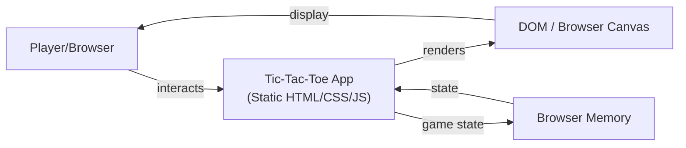

# Architecture: B3 Tic-Tac-Toe with Unbeatable AI

**Status:** Final  
**Author:** Architecture Team  
**Date:** 2026-05-06  
**Version:** 1.0  
**Related PRD:** [prd_final.md](prd_final.md)

---

## 1. Overview
A single-page, static web application implementing a Tic-Tac-Toe game with three play modes: Player vs. Player, Easy AI, and Impossible AI (using minimax algorithm). The application runs entirely in the browser with no backend server, making it deployable as a static site to GitHub Pages. The AI decision visualization displays minimax scores for each legal move before the AI takes its turn.

---

## 2. Goals & Non-Goals

### Goals
- **Completely client-side:** No backend server required; all logic runs in the browser.
- **Unbeatable Impossible AI:** Minimax algorithm guarantees AI never loses.
- **Score visualization:** Display evaluation score for each legal move before AI moves.
- **Correct game logic:** Accurate win/draw/ongoing detection; no moves after terminal state.
- **Static deployment:** Deploy directly to GitHub Pages with no build pipeline complexity.

### Non-Goals
- **Persistent storage:** No game history, replay, or cloud sync.
- **Multiplayer online:** Single-device play only.
- **Backend services:** No API server, database, or authentication.
- **Mobile app:** Web-only (responsive web design satisfies mobile needs).

---

## 3. System Context



**System Boundary:** The entire application is a single-page web application (SPA) running in a modern browser. No network calls after initial page load.

**External Actor:** Human player(s) interacting via mouse/touch on the rendered board.

---

## 4. Component Design

| Component | Responsibility | Technology |
|-----------|----------------|-----------|
| **UI Renderer** | Render board, mode selector, scores, game status messages | HTML5 Canvas or DOM (divs/buttons) |
| **Game State Manager** | Maintain current board state, turn tracking, win/draw detection | JavaScript object / class |
| **Minimax Engine** | Evaluate board positions; compute optimal AI move; alpha-beta pruning (optional) | Pure JavaScript recursive function |
| **Easy AI** | Random legal move selection | JavaScript utility |
| **Move Executor** | Apply human or AI move to board; trigger state updates | JavaScript function |
| **Event Handler** | Listen for clicks; route to appropriate handler (mode selection, cell click, rematch) | DOM event listeners |
| **Score Visualizer** | Display minimax scores for open cells before AI moves; clear after move | UI overlay or board annotation |

---

## 5. Data Flow

### Game Initialization Flow
```
User loads page 
  → Render mode selection screen
  → User clicks mode (PvP / Easy / Impossible)
  → Initialize board state [empty 3×3 grid]
  → Render board
  → If AI opponent, AI takes first turn (optional game design choice)
```

### Move Execution Flow (Human Turn)
```
User clicks cell
  → Validate cell is empty and game not terminal
  → Place human mark (X) on board
  → Update game state
  → Check for human win/draw
  → If terminal, display result and disable moves
  → If ongoing and AI opponent, trigger AI turn
```

### AI Move Flow (Impossible AI)
```
AI turn triggered
  → Run minimax(board, depth=0, isMaximizing=true, alpha=-inf, beta=+inf)
  → Minimax returns { score, move } for each legal cell
  → Visualize scores on UI
  → User sees scores momentarily (2 second display)
  → Execute best move (highest score)
  → Place AI mark (O) on board
  → Check for AI win/draw
  → If terminal, display result and disable moves
  → If ongoing, return to human turn
```

### Minimax Algorithm Detail
```
minimax(board, depth, isMaximizing, alpha, beta):
  if board is terminal (win/loss/draw):
    return { score: scoreTerminal(board), move: null }
  
  if isMaximizing (AI turn):
    maxScore = -infinity
    bestMove = null
    for each legal move in board:
      apply move, recurse, undo move
      if score > maxScore:
        maxScore = score
        bestMove = move
      beta = min(beta, maxScore)
      if beta <= alpha: prune
    return { score: maxScore, move: bestMove }
  
  else (Minimizing — human turn):
    minScore = +infinity
    bestMove = null
    for each legal move in board:
      apply move, recurse, undo move
      if score < minScore:
        minScore = score
        bestMove = move
      alpha = max(alpha, minScore)
      if beta <= alpha: prune
    return { score: minScore, move: bestMove }
```

---

## 6. Data Model

| Entity | Key Fields | Description |
|--------|-----------|-------------|
| **Board** | cells[0-8] (flattened 3×3) | 3×3 Tic-Tac-Toe grid; values: empty, X, O. Index layout: `0 1 2 / 3 4 5 / 6 7 8` |
| **GameState** | board, currentTurn, gameStatus, mode | Encapsulates active game; currentTurn: 'human' \| 'ai'; gameStatus: 'ongoing' \| 'human_win' \| 'ai_win' \| 'draw' |
| **Move** | cellIndex, mark | cellIndex: 0-8; mark: 'X' (human) or 'O' (AI) |
| **MinimaxResult** | score, move | score: 1 (AI win), 0 (draw), -1 (human win); move: cell index (0-8) |

---

## 7. API / Interface Design

### Public Functions

| Function | Signature | Description | Returns |
|----------|-----------|-------------|---------|
| `initializeGame(mode)` | (mode: 'pvp' \| 'easy' \| 'impossible') → void | Set up new game with selected mode. | – |
| `getBoard()` | () → number[] | Return current board state (flattened array). | 9-element array |
| `makeMove(cellIndex)` | (cellIndex: 0-8) → boolean | Place human mark; return success. | true if valid, false if invalid |
| `getGameStatus()` | () → string | Return current status. | 'ongoing' \| 'human_win' \| 'ai_win' \| 'draw' |
| `getMinimaxScores()` | () → Map\<number, number\> | Return score for each legal move. | Map of cellIndex → score (-1/0/1) |
| `aiMove()` | () → void | Execute AI move (Easy or Impossible based on mode). | – |
| `resetGame()` | () → void | Clear board and return to mode selection. | – |

### UI Events (Event-Driven Interface)

| Event | Payload | Handler Action |
|-------|---------|--------------|
| `modeSelected` | { mode: string } | Initialize game with selected mode |
| `cellClicked` | { cellIndex: number } | Attempt human move; trigger AI if applicable |
| `rematchClicked` | {} | Reset game state; show mode selector |
| `scoresDisplayRequested` | {} | Show minimax scores for 2 seconds, then clear |

---

## 8. Infrastructure & Deployment

**Technology Stack:**
- **Frontend:** HTML5, CSS3, JavaScript (ES6+)
- **Rendering:** DOM manipulation (or Canvas for performance if needed)
- **Deployment:** GitHub Pages (static site)
- **No backend, no database, no CI/CD pipeline required for MVP.**

**Deployment Architecture:**
```
Source Code (JS, HTML, CSS)
  ↓
  Git commit to deploy/<app-name> branch
  ↓
  GitHub Actions workflow triggers (optional; can also use GitHub Pages direct push)
  ↓
  Static files copied to gh-pages branch
  ↓
  GitHub Pages serves at https://<username>.github.io/SDLC/
```

---

## 9. Security & Privacy Considerations

- **No PII collected:** Game does not store, transmit, or collect any personal information.
- **No authentication required:** Single-device play; no user accounts.
- **Client-side only:** No network calls after initial page load; no CORS or server trust required.
- **XSS prevention:** Ensure all dynamic content (scores, status messages) is escaped if inserted into DOM.
- **No external dependencies on untrusted CDNs:** Use inline scripts or verify subresource integrity (SRI) for any external libraries.

---

## 10. Scalability & Performance

**Expected Load:**
- Single player on single device; no concurrent sessions or network bottlenecks.
- Minimax evaluation on 3×3 board: worst case ~549,946 nodes (full game tree), but alpha-beta pruning reduces to ~~50,000 in typical cases.

**Performance Targets:**
- **AI move latency:** ≤ 2 seconds (acceptable human perception).
- **Score visualization:** Instant (no re-render lag).
- **Board responsiveness:** ≤ 100ms from click to visual feedback.

**Scaling Strategy:**
- No scaling needed for MVP (single-player, client-side).
- If extending to multiplayer: would require backend + WebSockets (out of scope).

**Caching:**
- Board state cached in JavaScript memory during active game.
- No persistent cache or localStorage needed for MVP.

**Bottlenecks:**
- Minimax recursion depth: On 3×3, max depth ~9 (manageable).
- Browser event loop: Not a concern for single player.
- If moving to 4×4 or 5×5: minimax tree grows exponentially; alpha-beta pruning becomes critical.

---

## 11. Observability

**Logging:**
- Log AI move evaluation results (score, chosen move) to browser console (for debugging/learning).
- Optional: log game outcome (win/loss/draw) for player statistics (not required for MVP).

**Metrics:**
- Game completion rate, win/loss/draw counts (optional; use localStorage if desired).
- AI move time (measure in JavaScript with `performance.now()`).

**Alerts:**
- None required (no backend).

**Tracing:**
- Stack traces for unhandled errors logged to console.

---

## 12. Dependencies & Risks

| Item | Type | Owner | Mitigation |
|------|------|-------|------------|
| Minimax correctness | Dependency | Engineering | Comprehensive unit tests; exhaustive game tree validation; manual play testing. |
| Browser compatibility | Risk | Engineering | Test on Chrome, Firefox, Safari, Edge. Use ES6+ with polyfills if needed. |
| Minimax performance | Risk | Engineering | Alpha-beta pruning; optimize recursion; measure move time. Acceptable if ≤ 2s. |
| Score display UX | Risk | Design | Iterate on placement; avoid clutter; use clear color contrast. |
| GitHub Pages deployment | Risk | DevOps | Ensure `.github/workflows` directory exists; GitHub Actions enabled; `gh` CLI available. |

---

## 13. Open Questions & Assumptions

- **Assumption:** Browser environment is modern (ES6, DOM API, Canvas optional). IE11 not required.
- **Assumption:** 3×3 board minimax is fast enough without heavy optimization; alpha-beta pruning is optional for MVP.
- **Assumption:** No replay or game history needed; game state is ephemeral (lost on page reload).
- **Open question:** Should scores remain visible after AI moves, or only before? _(Recommend: clear after move for cleaner UI.)_
- **Open question:** If extending to 4×4 or 5×5, should minimax be refactored for iterative deepening or memoization? _(Answer: Yes, memoization highly recommended to avoid exponential growth.)_

---

## 14. Alternatives Considered

| Option | Pros | Cons | Decision |
|--------|------|------|----------|
| **Client-side minimax (chosen)** | No backend needed; instant deployment; all logic transparent | Slower for 5×5+ boards without memoization | ✅ Selected for MVP |
| **Backend minimax (REST API)** | Could offload computation; enable multiplayer | Adds complexity; requires server; delays deploy | ❌ Out of scope for static site |
| **Hardcoded game tree** | Fastest lookup | Inflexible; huge code size even for 3×3 | ❌ Rejected |
| **Monte Carlo tree search** | Good for larger boards | Overkill for 3×3; less deterministic | ❌ Rejected |

---

## 15. Appendix

**Related Documents:**
- [prd_final.md](prd_final.md) — Product requirements and success metrics.
- Minimax Algorithm: https://en.wikipedia.org/wiki/Minimax (reference)
- Alpha-Beta Pruning: https://en.wikipedia.org/wiki/Alpha%E2%80%93beta_pruning (reference)

**Code Structure (Suggested):**
```
index.html
  ├─ GameState class
  ├─ MinimaxEngine class (with alpha-beta pruning)
  ├─ UIRenderer class (board, scores, messages)
  ├─ EventHandler class (click handlers, mode selection)
  ├─ AIModeEasy class (random move selection)
  ├─ Utils (terminal detection, move validation, score display)
  └─ main() entry point
styles.css
  └─ board, cells, score overlays, mode selector styles
```

**Testing Strategy:**
- Unit tests for minimax (validate scores for known positions).
- Integration tests for game flow (move sequence, win detection, AI behavior).
- Manual play testing to verify AI never loses.
- UI responsiveness testing on multiple browsers.
