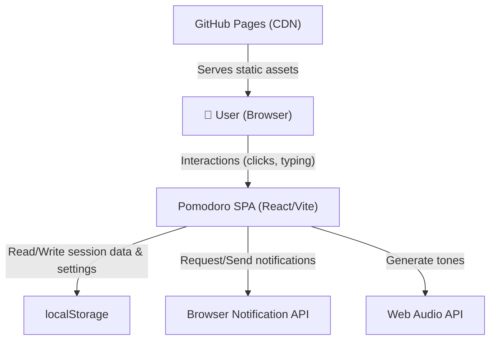
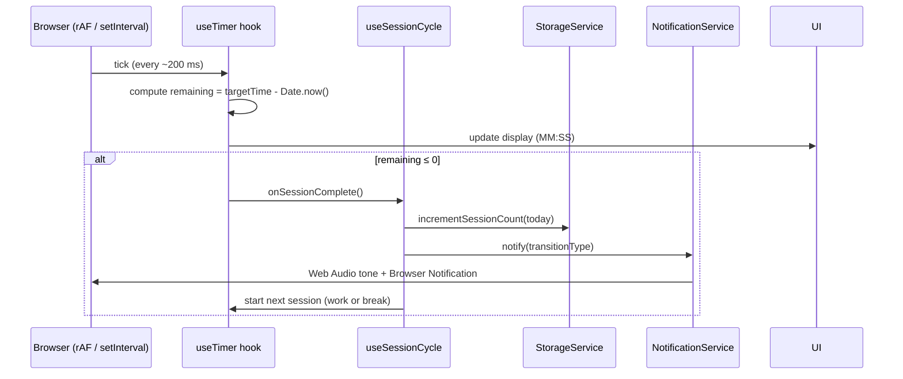
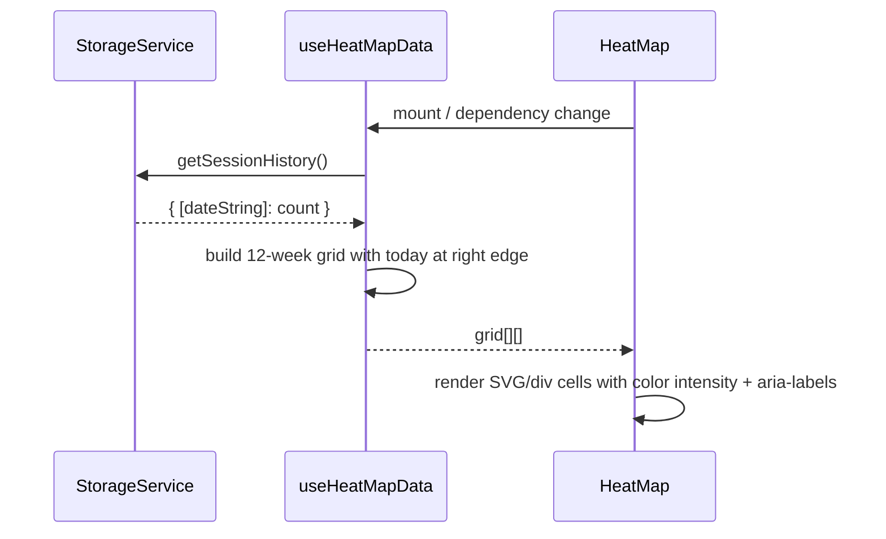
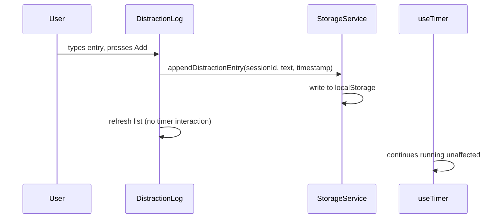

# Architecture: Pomodoro Timer with Analytics

**Status:** Draft  
**Author:** SDLC Pipeline  
**Date:** May 5, 2026  
**Version:** 1.0  
**Related PRD:** `prd_final.md`

---

## 1. Overview
A fully client-side single-page React application that implements a drift-corrected Pomodoro timer, browser and audio notifications, a persistent daily session heat map, and an in-session distraction log. All state lives in the browser via `localStorage`; there is no backend. The application is built with Vite + React + TypeScript and deployed as a static site on GitHub Pages.

## 2. Goals & Non-Goals
### Goals
- Drift-corrected countdown timer accurate to ±1 second over a 25-minute session.
- Automatic work↔break cycling with audio (Web Audio API) and Browser Notification API alerts.
- Heat map visualisation of daily session counts across 12 rolling weeks.
- Persistent storage of session history and distraction log via `localStorage`.
- Configurable work and break durations.
- In-session distraction log that never interrupts the running timer.
- Accessible, responsive UI (≥ 320 px viewport).

### Non-Goals
- Server-side storage or cloud sync.
- User authentication.
- Third-party service integrations.
- Mobile native packaging.

## 3. System Context



All runtime data flows stay within the browser. No user data leaves the device.

## 4. Component Design
| Component | Responsibility | Technology / Layer |
|-----------|---------------|-------------------|
| `App` | Root component; composes layout, provides global context | React, TypeScript |
| `TimerEngine` | Drift-corrected countdown logic using `Date.now()` timestamps; emits tick and completion events | Custom hook (`useTimer`) |
| `TimerDisplay` | Renders the current countdown (MM:SS), session type (Work/Break), and control buttons | React Component |
| `SessionCycler` | Tracks pomodoro count, decides work↔break transitions, triggers long-break logic after 4 sessions | Custom hook (`useSessionCycle`) |
| `NotificationService` | Requests browser notification permission; dispatches notifications and plays audio tones via Web Audio API | Service module + custom hook |
| `HeatMap` | Renders a 12-week calendar grid; color-codes each cell by session count; includes aria-labels | React Component |
| `DistractionLog` | Accepts free-text entries during active work session; displays log per session; persists to localStorage | React Component + hook |
| `SettingsPanel` | Form for configuring work duration, short break duration, and long break duration | React Component |
| `StorageService` | Serialises/deserialises session history, distraction log, and settings to/from `localStorage` | Utility module |
| `useHeatMapData` | Hook that aggregates localStorage data into a 12-week grid structure for the HeatMap component | Custom hook |
| `StreakTracker` | (P2) Computes daily/weekly streak and emits badge events | Custom hook |

## 5. Data Flow

### 5.1 Timer Tick & Session Completion


### 5.2 Heat Map Render


### 5.3 Distraction Log Entry


## 6. Data Model

### localStorage Keys
| Key | Type | Description |
|-----|------|-------------|
| `pomo_session_history` | `Record<string, number>` | Map of `YYYY-MM-DD` → completed session count |
| `pomo_distractions` | `DistractionEntry[]` | Array of distraction log entries |
| `pomo_settings` | `PomodoroSettings` | User-configured durations and preferences |

### TypeScript Interfaces
```ts
interface PomodoroSettings {
  workDuration: number;       // minutes, default 25
  shortBreakDuration: number; // minutes, default 5
  longBreakDuration: number;  // minutes, default 15
  longBreakInterval: number;  // sessions before long break, default 4
}

interface DistractionEntry {
  id: string;                 // uuid
  sessionDate: string;        // YYYY-MM-DD
  sessionIndex: number;       // which pomodoro in the day
  text: string;
  timestamp: string;          // ISO 8601
}

type SessionHistory = Record<string, number>; // YYYY-MM-DD → count
```

## 7. API / Interface Design

This application has no external API. Internal module contracts:

| Hook / Function | Description | Inputs | Outputs |
|----------------|-------------|--------|---------|
| `useTimer(durationMs)` | Drift-corrected countdown | Duration in ms | `{ remaining, isRunning, start, pause, reset }` |
| `useSessionCycle(settings)` | Manages work/break sequencing | `PomodoroSettings` | `{ sessionType, pomodoroCount, startNext }` |
| `StorageService.incrementSessionCount(date)` | Adds 1 to the day's count | `YYYY-MM-DD` string | `void` |
| `StorageService.getSessionHistory()` | Reads all daily counts | — | `SessionHistory` |
| `StorageService.appendDistractionEntry(entry)` | Appends to distraction log | `DistractionEntry` | `void` |
| `StorageService.saveSettings(settings)` | Persists settings | `PomodoroSettings` | `void` |
| `StorageService.loadSettings()` | Reads settings | — | `PomodoroSettings` |
| `NotificationService.requestPermission()` | Requests notification permission | — | `Promise<boolean>` |
| `NotificationService.notify(title, body)` | Shows notification + plays tone | `string, string` | `void` |

## 8. Infrastructure & Deployment

- **Build tool:** Vite (produces optimised static assets in `dist/`)
- **Hosting:** GitHub Pages, served from the `deploy/pomodoro-app` branch
- **CI/CD:** GitHub Actions workflow (`.github/workflows/deploy.yml`) triggers on push to `deploy/**`
- **Base path:** Configured in `vite.config.ts` as the GitHub repo name (e.g., `/pomodoro-app/`)
- **No server, no database, no CDN configuration required** — GitHub Pages handles caching headers

## 9. Security & Privacy Considerations
- **Authentication/Authorization:** Not applicable — no user accounts.
- **Data at rest:** All data stored in browser `localStorage`. Scoped to the origin; not accessible cross-origin.
- **Data in transit:** No user data is transmitted. Application is served over HTTPS (GitHub Pages enforces this).
- **PII / sensitive data handling:** Distraction log text is user-generated. It never leaves the browser. No analytics SDKs or external scripts are loaded.
- **Content Security Policy:** No inline scripts; all logic is bundled by Vite. A strict CSP can be added via a `_headers` file if desired.

## 10. Scalability & Performance
- **Expected load:** Single-user, single-browser. No concurrency concerns.
- **Scaling strategy:** N/A — static file hosting scales automatically.
- **Caching:** Vite outputs content-hashed filenames for aggressive browser caching. `index.html` should use `no-cache` (GitHub Pages default).
- **Known bottlenecks:** `localStorage` serialisation on every tick would be wasteful — session counts are only written on session completion, not on every tick.

## 11. Observability
- **Logging:** Browser `console.warn` for permission denials and storage errors in development.
- **Metrics:** None server-side. User can optionally export CSV of session history (P2).
- **Alerts:** N/A.
- **Tracing:** N/A.

## 12. Dependencies & Risks
| Item | Type | Owner | Mitigation |
|------|------|-------|------------|
| `localStorage` availability | Dependency | Browser | Wrap in try/catch; warn user if unavailable (e.g., private browsing quotas) |
| Browser Notification API permission denied | Risk | User | Audio-only fallback; graceful UI message |
| setInterval/rAF throttled in background tabs | Risk | Engineering | Use `Date.now()` delta-based timer, not tick counting |
| Web Audio API support | Dependency | Browser | Tested in Chrome, Firefox, Safari, Edge; silent fallback if unsupported |
| GitHub Pages `base` path mismatch | Risk | DevOps | `vite.config.ts` base path set at build time via pipeline |

## 13. Open Questions & Assumptions
- **Assumption:** Vite + React + TypeScript is the chosen stack (aligns with modern React ecosystem and fast build times).
- **Assumption:** Heat map shows 12 rolling weeks with today at the right edge.
- **Assumption:** Long break logic (P2) is included in the initial implementation but togglable.
- **Open question:** Should distraction entries be tied to a specific pomodoro session ID for future grouping/export?
- **Open question:** Should the app warn when `localStorage` is near the 5 MB browser quota?

## 14. Alternatives Considered
| Option | Pros | Cons | Decision |
|--------|------|------|----------|
| Plain HTML/CSS/JS (no framework) | Zero dependencies, fastest load | Hard to maintain component state cleanly | Rejected — React provides clear state/component model |
| Next.js | SSR, routing | Overkill for a single-page static tool | Rejected — no server needed |
| Zustand for state management | Clean global state | Adds dependency for a small app | Deferred — React Context + hooks sufficient for this scale |
| IndexedDB instead of localStorage | Larger quota, async API | More complex; overkill for KB-scale data | Rejected — localStorage is sufficient |
| Canvas for heat map | Full rendering control | More code, accessibility harder | Rejected — CSS grid/flexbox + aria-labels is simpler |

## 15. Appendix
- Related PRD: `prd_final.md`
- Source requirements: `Requirements 3.md`
- Expected outcomes: `Expected-Outcomes 3.md`
- Vite docs: https://vitejs.dev
- GitHub Pages: https://pages.github.com
- Web Audio API: https://developer.mozilla.org/en-US/docs/Web/API/Web_Audio_API
- Browser Notifications: https://developer.mozilla.org/en-US/docs/Web/API/Notifications_API
