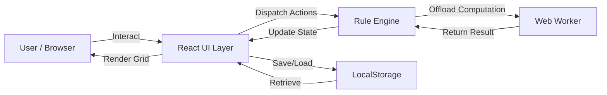
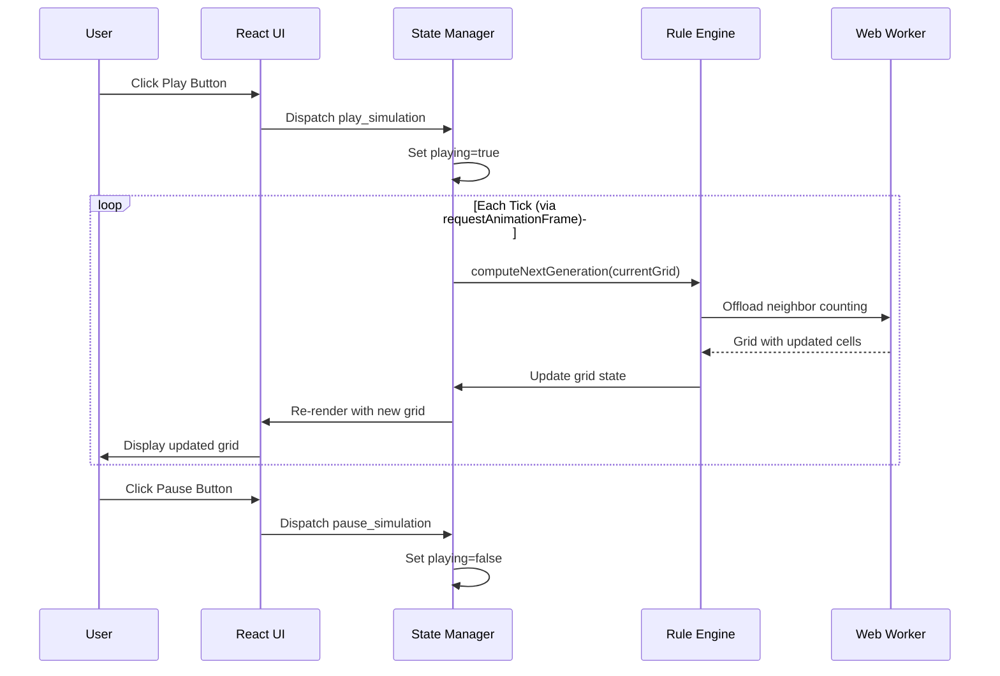
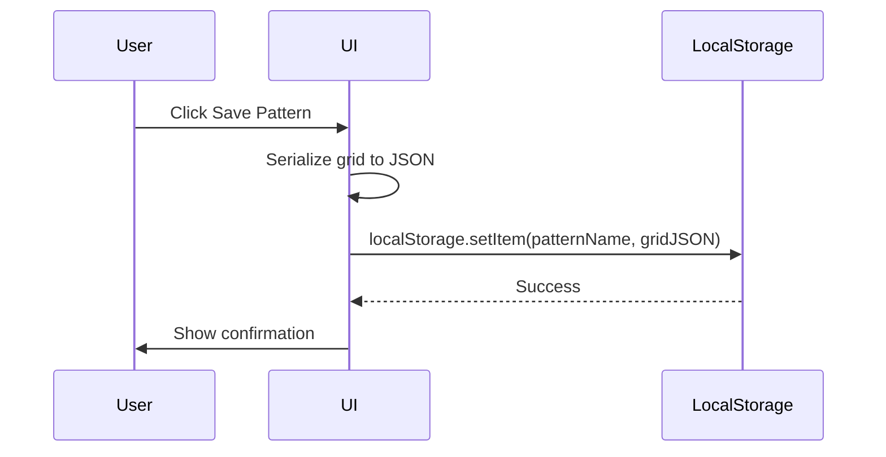
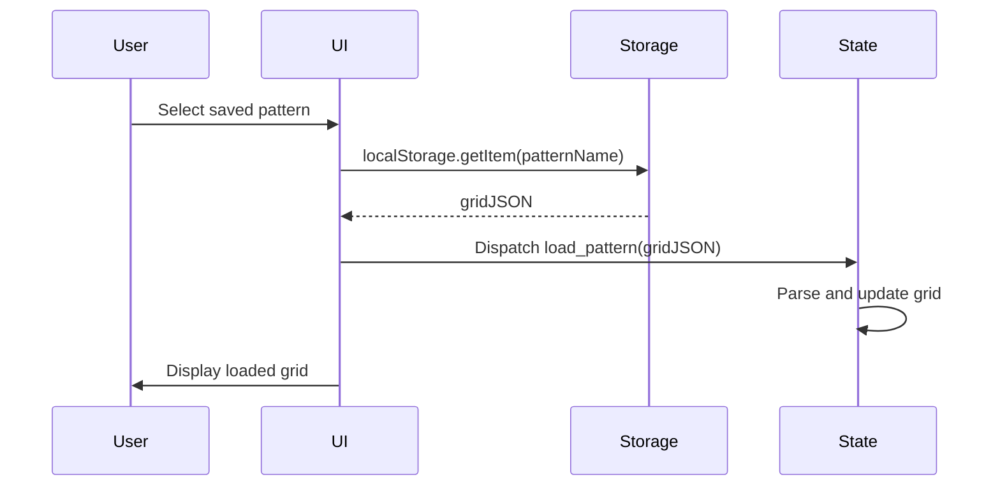

# Architecture: Conway's Game of Life Sandbox

**Status:** Complete  
**Author:** Architecture Team  
**Date:** May 5, 2026  
**Version:** 1.0  
**Related PRD:** prd_final.md

---

## 1. Overview
Conway's Game of Life Sandbox is a client-side React application that simulates Conway's Game of Life on a user-configurable 2D grid. The application provides an interactive UI for cell drawing, playback control, and pattern management. Core simulation logic runs in a Web Worker to maintain responsive UI during heavy computation. All state and patterns are persisted locally via browser storage. The architecture prioritizes correctness of cellular automata rules, responsive rendering, and modular design to support future extensions (alternative rulesets, advanced patterns, RLE import/export).

## 2. Goals & Non-Goals
### Goals
- Deliver a correct, performant implementation of Conway's Game of Life
- Provide intuitive, responsive user controls (draw, play, pause, step, adjust speed)
- Enable pattern storage, retrieval, and library access
- Support scalable grid sizes (up to 200×200) with acceptable performance
- Maintain modular, testable architecture
- Enable future extensibility for alternative rulesets and advanced features

### Non-Goals
- Backend persistence or user accounts (purely client-side)
- Real-time multiplayer collaboration
- Mobile touch optimization (responsive layout only)
- Server-side rendering or API layer
- Analytics or telemetry

## 3. System Context



The application is fully client-side. Users interact with the React UI, which dispatches actions to the state management layer (Rules Engine). Heavy computation is offloaded to a Web Worker to keep the UI responsive. All patterns and user state are persisted in browser LocalStorage. No external services or backends are required.

## 4. Component Design

| Component | Responsibility | Technology / Layer |
|-----------|---------------|-------------------|
| **Grid Component** | Render the 2D cellular grid; handle cell clicks and drag interactions; provide visual feedback | React, Canvas or DOM grid |
| **Controls Panel** | Expose Play/Pause/Step buttons, speed slider, grid size input, clear and reset controls | React, TypeScript |
| **Pattern Library** | Display selectable patterns (glider, blinker, pulsar, glider gun); handle pattern placement on grid | React, Data store |
| **Stats Display** | Show generation counter and live cell count in real time | React, derived from state |
| **Save/Load Modal** | UI for saving current grid state and loading previously saved patterns | React, LocalStorage API |
| **Rule Engine** | Apply Conway's Game of Life rules to compute next generation; manage grid state; validate boundary conditions | TypeScript, business logic |
| **Web Worker** | Execute neighbor counting and rule application in background thread; return new grid state | JavaScript Worker API |
| **State Manager** | Maintain current grid state, simulation speed, generation counter, UI mode (paused/playing) | React Context or similar |
| **Storage Service** | Interface to browser LocalStorage; serialize/deserialize grid state; handle save/load operations | TypeScript utility |

## 5. Data Flow

### Main Simulation Loop


### Save Pattern Flow


### Load Pattern Flow


## 6. Data Model

### Grid State
```
Grid {
  cells: boolean[][]              // 2D array, true = alive, false = dead
  width: number                   // Grid width (10–200)
  height: number                  // Grid height (10–200)
  generation: number              // Current generation count
  liveCellCount: number           // Count of alive cells
  boundaryMode: 'wrap' | 'death'  // Edge behavior
}
```

### Application State
```
AppState {
  grid: Grid
  isPlaying: boolean              // true = simulation running
  speed: number                   // Generations per second (1–10)
  selectedPattern: string | null  // Currently selected pattern from library
  savedPatterns: Map<string, GridState> // User-saved patterns in LocalStorage
}
```

### Pattern Library Entry
```
Pattern {
  name: string                    // e.g., "Glider"
  description: string             // Brief description
  grid: Grid                       // Minimal bounding box containing pattern
  width: number                   // Pattern dimensions
  height: number
  tags: string[]                  // e.g., ["spaceship", "period-4"]
}
```

## 7. API / Interface Design

### Rule Engine API
| Method | Description | Input | Output |
|--------|-------------|-------|--------|
| `computeNextGeneration(grid)` | Apply Conway's rules to compute next grid state | `Grid` | `Grid` (new generation) |
| `countNeighbors(grid, x, y)` | Count alive neighbors for cell at (x, y) | `Grid, number, number` | `number` (0–8) |
| `isAlive(grid, x, y)` | Check if cell at (x, y) is alive, handling boundaries | `Grid, number, number` | `boolean` |
| `toggleCell(grid, x, y)` | Toggle cell state (alive ↔ dead) | `Grid, number, number` | `Grid` (updated copy) |

### Storage Service API
| Method | Description | Input | Output |
|--------|-------------|-------|--------|
| `savePattern(name, grid)` | Save grid state to LocalStorage | `string, Grid` | `void` or error |
| `loadPattern(name)` | Retrieve saved grid from LocalStorage | `string` | `Grid \| null` |
| `listSavedPatterns()` | Get list of all saved pattern names | — | `string[]` |
| `deletePattern(name)` | Remove saved pattern | `string` | `void` |

### UI State Actions (React Context / Redux-like)
| Action | Payload | Effect |
|--------|---------|--------|
| `PLAY_SIMULATION` | — | Set `isPlaying = true` |
| `PAUSE_SIMULATION` | — | Set `isPlaying = false` |
| `STEP_GENERATION` | — | Compute next generation and increment counter |
| `SET_SPEED` | `number` | Update simulation speed (1–10) |
| `TOGGLE_CELL` | `{x, y}` | Toggle cell state in grid |
| `LOAD_PATTERN` | `{name, grid}` | Replace grid with loaded pattern |
| `CLEAR_GRID` | — | Set all cells to dead |
| `RESIZE_GRID` | `{width, height}` | Create new grid with given dimensions |

## 8. Infrastructure & Deployment

**Environment:** Browser (client-side only)

**Build & Bundling:**
- Build tool: Vite (for fast HMR and optimized production bundles)
- Target: ES2020+ (modern browsers)
- Output: Single HTML file + CSS + JavaScript + optional Web Worker bundle

**Hosting:**
- Platform: GitHub Pages (static hosting only; no server process)
- Deployment: GitHub Actions workflow triggered on push to `deploy/<app-name>` branch
- Artifacts: Vite `dist/` folder

**Browser APIs Required:**
- `requestAnimationFrame()` — smooth animation loop
- `Web Workers` — background computation (graceful fallback to main thread if unavailable)
- `LocalStorage` — pattern persistence (fallback to in-memory storage if quota exceeded or disabled)
- Canvas or DOM — grid rendering

## 9. Security & Privacy Considerations

- **Authentication/Authorization:** None. Purely client-side; no user identity required.
- **Data at rest:** All user patterns stored in browser LocalStorage. No encryption; assumes trusted device. Users should clear browser storage if device is shared.
- **Data in transit:** No data transmitted. Purely local computation.
- **PII / sensitive data handling:** No PII collected. No third-party analytics or telemetry.
- **Content Security Policy:** Static assets only; no inline scripts or external CDN dependencies (if possible).

## 10. Scalability & Performance

**Expected Load:**
- Single user, single browser instance
- Grid sizes up to 200×200 (40,000 cells)
- Simulation speeds 1–10 generations per second
- Save/load operations infrequent (user-initiated)

**Scaling Strategy:**
- Computation is parallelizable; Web Worker runs on separate thread (no multi-threading beyond Web Worker)
- For very large grids (>200×200), consider sparse grid representation or quadtree
- No backend scaling needed; purely client-side

**Caching:**
- Grid state cached in React component state
- Pattern library cached in memory during session
- No HTTP caching relevant (static assets only)

**Known Bottlenecks & Mitigations:**
- **Neighbor counting at scale:** O(n) per cell per generation. Mitigation: use Web Worker to prevent UI blocking; optimize algorithm to skip dead zones
- **Rendering full grid:** Re-render only changed cells using Canvas or targeted DOM updates, not full grid redraw
- **LocalStorage quota:** Typical quota ~5–10 MB. Mitigation: warn user if quota approaching; implement pattern compression

**Target Performance:**
- ≥30 FPS on 100×100 grid at normal speeds
- <100 ms time-to-interactive
- Save/load operations complete within <500 ms

## 11. Observability

**Logging:**
- Browser console logs for debugging (development only)
- No production analytics required

**Metrics:**
- FPS counter (optional UI widget for debugging)
- Generation counter (user-facing)
- Live cell count (user-facing)
- Simulation speed (user-facing)

**Alerts:**
- None required (single-user client-side app)
- Optional: warn user if LocalStorage quota nearly exceeded

**Tracing:**
- Optional: performance profiling in browser DevTools
- Web Worker offload time (performance monitoring)

## 12. Dependencies & Risks

| Item | Type | Owner | Mitigation |
|------|------|-------|------------|
| React 18+ | Dependency | Engineering | Standard; well-established ecosystem |
| Web Worker browser support | Dependency | Engineering | Graceful fallback to main thread |
| LocalStorage availability | Dependency | Engineering | Fallback to in-memory storage; warn user |
| Vite build tool | Dependency | DevOps | Lightweight, well-maintained alternative to Create React App |
| Boundary condition ambiguity | Risk | Product | Document clearly; set to 'wrap' or 'death' in PRD decision |
| Performance on large grids | Risk | Engineering | Profile early; implement sparse grid or quadtree if bottleneck found |
| Browser compatibility | Risk | QA | Test on Chrome, Firefox, Safari, Edge; use feature detection |
| Correctness of rules | Risk | Engineering | Extensive unit tests for rule engine; validate against known patterns |

## 13. Open Questions & Assumptions

- **Assumption:** Grid boundary mode is 'wrap' (toroidal topology). If 'death' is chosen, neighbor counting logic must be adjusted.
- **Assumption:** Web Workers are available in target browsers; fallback to main thread is acceptable.
- **Assumption:** LocalStorage is available and has sufficient quota (~1–5 MB for typical pattern saves).
- **Assumption:** Canvas rendering is available; DOM-based grid is acceptable fallback (slower).
- **Open question:** Should patterns be exportable as RLE (Run Length Encoding) for external tools? (Marked as stretch goal.)
- **Open question:** What is the upper limit on grid size before performance becomes unacceptable? Requires profiling.

## 14. Alternatives Considered

| Option | Pros | Cons | Decision |
|--------|------|------|----------|
| **WebGL rendering** | Very fast for large grids | Overkill; adds complexity; Canvas is sufficient | Use Canvas |
| **Dedicated backend + WebSocket** | Real-time collab potential | Adds server cost; violates client-side requirement | Client-side only |
| **Immutable state (Immer/Immer)** | Easier debugging, time travel | Slight perf overhead; unnecessary for this app | Mutable state with copy-on-write |
| **Web Assembly (WASM)** | Faster rule computation | Build complexity; minimal gain for this scale | Plain JavaScript + Web Worker |
| **Redux / Zustand state** | Mature patterns | Added dependency; Context API sufficient for this app | React Context API |
| **IndexedDB vs LocalStorage** | Larger quota (hundreds of MB) | Overkill; LocalStorage adequate for pattern saves | LocalStorage |

## 15. Appendix

**Related Documents:**
- [prd_final.md](prd_final.md) — Product requirements
- [Conway's Game of Life (Wikipedia)](https://en.wikipedia.org/wiki/Conway%27s_Game_of_Life)
- [LifeWiki Patterns](http://www.conwaylife.com/)

**Technical Stack:**
- React 18+
- TypeScript (recommended for type safety)
- Vite (build tool)
- Tailwind CSS or CSS Modules (styling)
- Web Workers API (background computation)

**Future Extensions:**
- Alternative rulesets (HighLife, Seeds, Day and Night)
- RLE pattern import/export
- Trail mode (cell age visualization)
- Pattern detection and auto-save on stabilization
