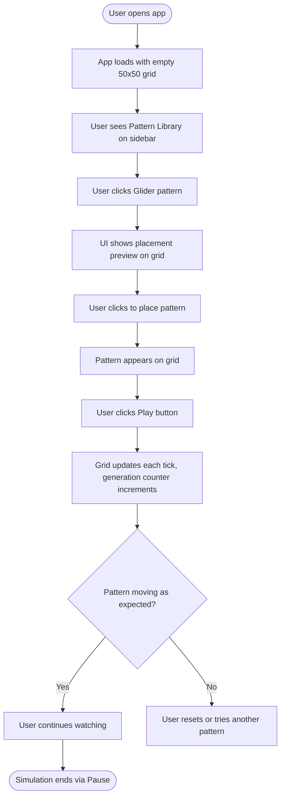
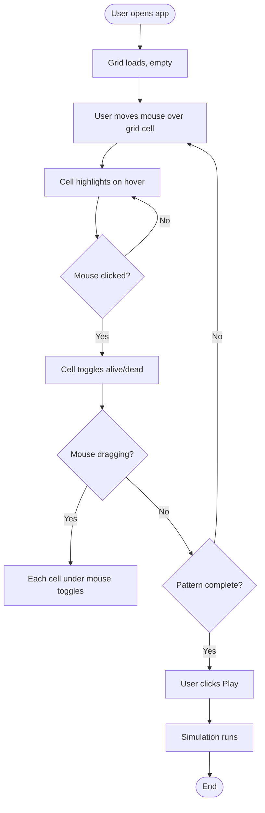
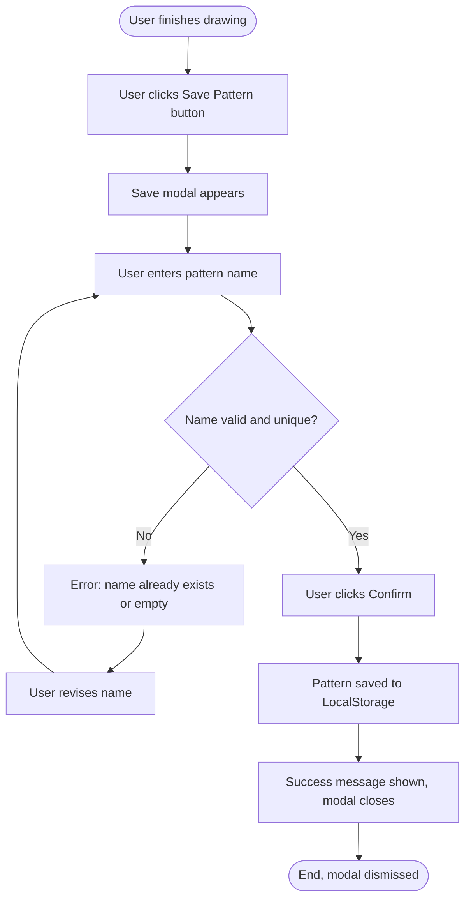
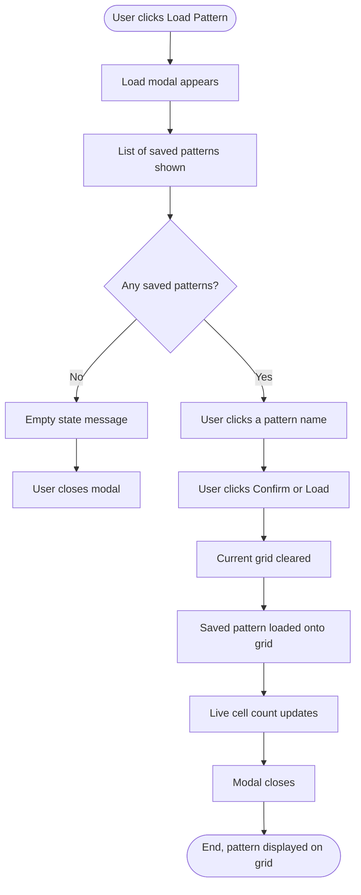
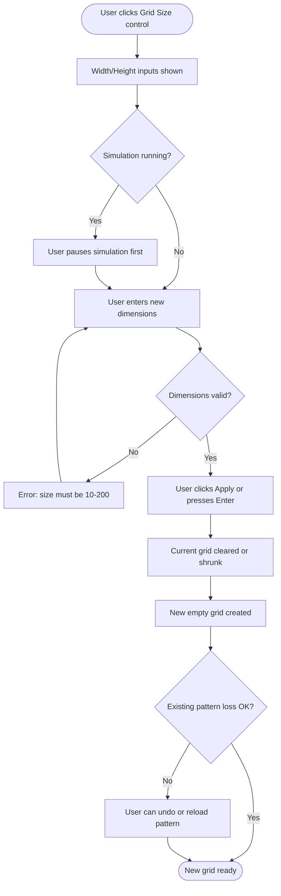
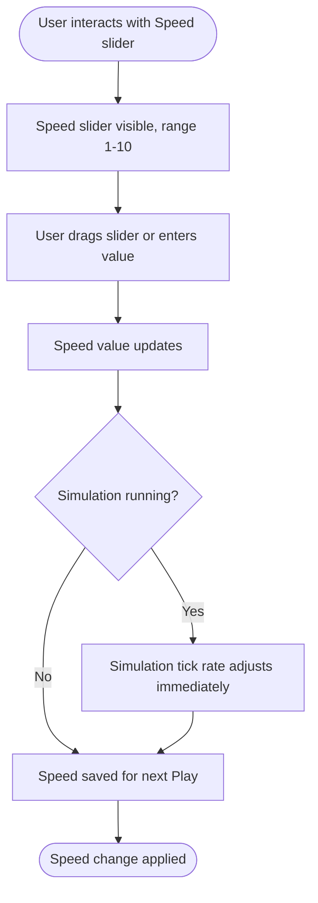
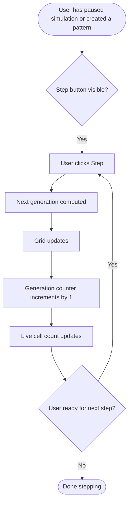
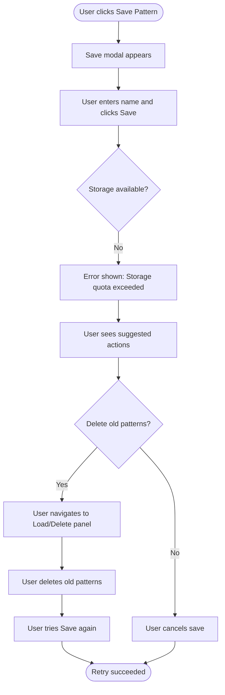

# UX Design: Conway's Game of Life Sandbox

**Status:** Complete  
**Author:** UX Design Team  
**Date:** May 5, 2026  
**Version:** 1.0  
**Related PRD:** prd_final.md  
**Related Architecture:** architecture_final.md

---

## 1. Overview
Conway's Game of Life Sandbox is an interactive, single-screen application where users can immediately start drawing cells on a grid, observing simulation behavior, and exploring patterns without friction. The UX prioritizes immediate interactivity—users can draw cells and press Play within seconds of opening the app—while providing power-user features (patterns library, save/load, speed control) as discoverable but secondary. The experience emphasizes exploration and experimentation; users should feel empowered to try things without fear of data loss.

## 2. User Goals

- **Primary goal:** Explore cellular automata behavior by creating patterns, running simulations, and observing emergent properties in real time.
- **Secondary goals:**
  - Discover interesting pre-built patterns (glider, blinker, pulsar, glider gun)
  - Save favorite patterns for later reference
  - Reload previously saved patterns
  - Understand how the grid evolves at different simulation speeds
  - Teach or learn about Conway's Game of Life interactively

---

## 3. User Personas

| Persona | Description | Key Need |
|---------|-------------|----------|
| **Educator (Dr. Chen)** | High school CS teacher, teaching discrete math | Clear, verifiable patterns; ability to show deterministic behavior to students; save/load to create reusable lesson plans |
| **Student (Maya)** | Undergraduate, taking a comp bio elective | Quick onboarding; instant feedback; ability to experiment without reading a manual |
| **Hobbyist (James)** | Self-taught programmer interested in cellular automata | Pattern library; save/load; access to well-known patterns; ability to customize grid size |
| **Researcher (Dr. Patel)** | Computer scientist studying emergent behavior | Performance on large grids; accurate rule execution; reproducibility via save/load |

---

## 4. User Flows

### Flow 1: Happy Path — Explore and Play with a Glider

_The primary scenario: user opens the app, selects a known pattern, places it, and runs a simulation._

**Steps:**
1. App loads with a blank 50×50 grid, generation counter at 0, live cell count at 0
2. User notices Pattern Library panel (right sidebar or modal)
3. User clicks on "Glider" pattern
4. Grid highlights the glider region with a semi-transparent overlay showing where it will be placed
5. User clicks on the grid to place the glider at chosen location
6. Glider cells are now alive on the grid; live cell count updates
7. User clicks the Play button
8. Grid updates every ~100 ms (default 10 generations/sec); generation counter increments
9. Glider visibly moves across the grid (after 4 generations, it returns to its original shape but shifted position)
10. User clicks Pause; simulation freezes

**Entry points:** App initialization or "Clear Grid" action  
**Exit points:** User saves pattern, tries another pattern, or closes the app

---

### Flow 2: Manual Drawing — Click and Drag to Sketch

_User draws directly on the grid to create custom patterns._

**Steps:**
1. User positions mouse over grid; cell highlights on hover (visual feedback)
2. User clicks a cell; it toggles to alive (filled/colored)
3. User clicks adjacent cells to build a pattern (e.g., a blinker: 3 cells in a row)
4. User can drag across multiple cells to toggle them rapidly
5. Live cell count updates in real time after each toggle
6. User clicks Play when pattern is complete
7. Simulation advances generation by generation

**Entry points:** App start or "Clear Grid"  
**Exit points:** Play button pressed; user saves the pattern

---

### Flow 3: Save Pattern — Persist User-Created Design

_User saves a custom pattern to browser storage for later retrieval._

**Steps:**
1. User creates a pattern and clicks "Save Pattern" button
2. Modal dialog appears with text input for pattern name
3. User types a name (e.g., "My Custom Blinker")
4. User clicks "Save" or presses Enter
5. App checks if name is valid (not empty, not already saved)
6. If valid: pattern is serialized to JSON and stored in LocalStorage; success message appears for 2–3 seconds
7. If invalid: error message displayed; user can revise name
8. Modal dismisses; user is back at the grid

**Entry points:** User finishes drawing and wants to save  
**Exit points:** Pattern saved successfully; user cancels save dialog

**Error states:**
- Empty name: "Please enter a pattern name"
- Duplicate name: "A pattern with this name already exists. Use a different name or delete the existing one."
- Storage quota exceeded: "Not enough storage available. Delete some saved patterns and try again."

---

### Flow 4: Load Pattern — Retrieve Saved Pattern

_User reloads a previously saved pattern from the library._

**Steps:**
1. User clicks "Load Pattern" button
2. Modal appears showing list of all saved patterns
3. If no patterns saved: empty state message "No saved patterns yet. Create and save a pattern to get started."
4. If patterns exist: user clicks a pattern name from the list
5. Pattern name and metadata (size, cell count) displayed in preview
6. User clicks "Load" or "Confirm"
7. Current grid clears
8. Saved pattern loads and is centered or placed at grid origin
9. Live cell count updates
10. Modal closes; user sees the loaded pattern on the grid, ready to simulate

**Entry points:** User wants to retrieve a previous pattern  
**Exit points:** Pattern loaded; modal dismissed

**Error states:**
- Saved pattern is larger than current grid: "Pattern is larger than current grid. Resize grid or start a new simulation."
- Storage corrupted / invalid JSON: "Saved pattern is corrupted. Delete it and try again."

---

### Flow 5: Adjust Grid Size — Resize for Different Explorations

_User changes grid dimensions to explore patterns at different scales._

**Steps:**
1. User clicks on the grid size control (typically width and height inputs)
2. Current dimensions displayed
3. User changes width or height (or both)
4. User clicks "Apply" or presses Enter
5. App validates input (must be 10–200 inclusive)
6. If invalid: error message "Grid size must be between 10 and 200"
7. If valid: grid is recreated at new dimensions (existing pattern is lost unless auto-saved)
8. New empty grid displayed

**Entry points:** User wants to explore at a different scale  
**Exit points:** Grid resized; user draws new pattern or loads a saved one

**Warning:** Resizing will clear the current grid. If user has unsaved progress, consider warning: "Resizing will clear the current pattern. Save it first?"

---

### Flow 6: Adjust Simulation Speed — Change Generation Rate

_User controls how fast the simulation ticks._

**Steps:**
1. Speed slider visible in controls panel, labeled "Speed" or "Generations per second"
2. Current speed displayed (e.g., "10 gen/sec")
3. User drags slider or enters a numeric value (1–10)
4. If simulation is running: tick rate adjusts immediately, no interruption
5. If simulation is paused: new speed takes effect when Play is clicked
6. Visual feedback (e.g., slider color or updated label) confirms change

**Entry points:** User wants to slow down or speed up simulation  
**Exit points:** Speed is set; simulation resumes or continues

---

### Flow 7: Step Through Generations — Manual Advance

_User clicks Step to advance exactly one generation without auto-play._

**Steps:**
1. User has a pattern drawn or loaded; simulation is paused
2. User clicks "Step" button
3. App computes the next generation (applies Conway's rules to all cells)
4. Grid visual updates to show new state
5. Generation counter increments by 1
6. Live cell count updates
7. User can click Step again to advance one more generation, or click Play to auto-advance

**Entry points:** User paused the simulation or just finished drawing  
**Exit points:** User clicks Play to resume auto-simulation, or closes the app

---

### Flow 8: Error State — Invalid Operation

_Example: user attempts to save a pattern but storage is full._

**Steps:**
1. User attempts to save a pattern
2. App tries to write to LocalStorage
3. LocalStorage quota exceeded error caught
4. Error message displayed: "Storage is full. Delete some saved patterns and try again."
5. User can click "Manage Patterns" to see and delete old saves
6. After cleanup, user retries save
7. Save succeeds

**Entry points:** Any save operation when storage is full  
**Exit points:** User successfully saves after cleanup, or cancels

---

## 5. Key Interaction Patterns

| Interaction | Pattern | Notes |
|-------------|---------|-------|
| **Cell toggle (click)** | Direct manipulation | Single cell toggles alive/dead; visual feedback instant |
| **Cell toggle (drag)** | Continuous input | User drags across cells; all under cursor toggle; enables rapid pattern drawing |
| **Play/Pause toggle** | Push-button with state | Button state changes (Play → Pause icon); simulation starts/stops immediately |
| **Slider (Speed)** | Continuous control | Real-time feedback; updates tick rate even during simulation |
| **Pattern selection** | List + Preview + Placement | User selects from list, sees preview/description, places on grid via click |
| **Modal dialogs (Save/Load)** | Form submission + confirmation | Text input, validation, confirmation button; clear dismiss affordance |
| **Error recovery** | Inline messaging + action suggestions | Errors shown with specific text (not just color); suggested next steps provided |
| **Empty states** | Message + CTA | When no patterns saved or grid empty, show helpful message with suggested action |

---

## 6. States & Variations

### Main Grid Display
- **Default state:** 50×50 grid with empty cells (all dead); generation counter = 0; live cell count = 0
- **Drawing state:** Grid active, cells toggle on click/drag; cursor changes on hover
- **Simulation running state:** Grid updates each tick; generation and live cell counts update; play button shows as "Pause"
- **Simulation paused state:** Grid frozen; play button shows as "Play"; step button available
- **Empty state:** User has not drawn or loaded anything; faint text overlay: "Click to draw cells or load a pattern"
- **Large grid state (150×150+):** Grid zoomed out to fit viewport; cells may appear smaller; hover/click still works with proper touch targets

### Controls Panel
- **Default state:** All buttons visible (Play, Pause, Step, Clear); controls enabled
- **Simulation running state:** Play button disabled/hidden (Pause shown instead); Step button disabled (greyed out)
- **Simulation paused state:** Play button enabled; Step button enabled; Pause button disabled/hidden
- **Grid empty state:** Play button disabled (no cells to simulate); Step button disabled; Clear button disabled (nothing to clear)

### Speed Slider
- **Default state:** Slider at position 10 (10 gen/sec); label shows "10 gen/sec"
- **User adjusting state:** Slider draggable; tooltip shows current value
- **Simulation running state:** Slider remains interactive; changes apply immediately

### Pattern Library Panel
- **Default state:** List of 4 patterns visible (Glider, Blinker, Pulsar, Glider Gun) with thumbnails/descriptions
- **Pattern selected state:** Selected pattern highlighted; placement mode active; user sees crosshair cursor
- **Placement preview state:** Semi-transparent overlay shows where pattern will appear; user can click to confirm
- **No patterns loaded state:** (Not applicable to built-in library, but for saved patterns:) Empty state message: "No saved patterns yet"

### Save/Load Modal
- **Save modal - default state:** Text input field (cursor in field), two buttons (Save, Cancel)
- **Save modal - error state:** Red error message under input, field highlighted; user can edit and retry
- **Save modal - success state:** Brief confirmation: "Pattern saved!" then modal auto-closes after 1–2 seconds
- **Load modal - empty state:** "You haven't saved any patterns yet. Create a pattern and save it to see it here."
- **Load modal - with patterns state:** List of pattern names; click to select, preview shown, Load button active

### Generation & Live Cell Counters
- **Default state:** Generation: 0; Live Cells: 0
- **During simulation state:** Both update every tick; smooth number transitions (no flashing)
- **Large numbers state:** Format as "1.2K" or "10,000" if necessary for readability

---

## 7. Accessibility Considerations (WCAG 2.1 AA)

| Element | Requirement | Notes |
|---------|------------|-------|
| **Keyboard navigation** | All interactive elements reachable via Tab; logical tab order | Play/Pause, Step, Speed, Clear, Pattern Library, Save/Load buttons all keyboard accessible |
| **Focus indicators** | Visible focus ring (3+ px, high contrast) on all focusable elements | Focus ring should be visible around buttons, slider, text inputs, grid cells |
| **Color contrast** | Minimum 4.5:1 for normal text, 3:1 for large text (≥18pt) | Grid cells (alive/dead) must have sufficient contrast; labels and buttons must meet ratio |
| **Screen reader support** | Meaningful alt text, ARIA labels, live regions for dynamic updates | Grid updates should trigger live region announcements; counter updates announced |
| **Form fields** | All inputs labeled with <label> or aria-label; error messages associated with inputs | Save dialog input should have clear label; error messages linked to input |
| **Error messages** | Errors identified in text, not color alone | Red text with descriptive message (e.g., "Error: name already exists") |
| **Interactive elements** | Minimum 44×44 px touch target (or sufficient spacing for pointer) | Grid cells should be at least 20×20 px; buttons 44×44 px |
| **Motion & animations** | Respect prefers-reduced-motion; critical feedback not motion-only | Simulation loop respects prefers-reduced-motion; live cell count updates via text, not animation |
| **Language & clarity** | Plain language; labels are descriptive | "Play" not "Start"; "Save Pattern" not "Persist"; error messages specific |

---

## 8. Copy & Microcopy

| Element | Proposed Copy | Notes |
|---------|--------------|-------|
| **Play button** | "Play" | Changes to "Pause" when simulation running |
| **Pause button** | "Pause" | Visible only during simulation |
| **Step button** | "Step" | Advances one generation |
| **Clear button** | "Clear Grid" | Resets all cells to dead |
| **Pattern button (CTA)** | "Load Pattern" or "Browse Patterns" | Opens pattern library / load modal |
| **Save button** | "Save Pattern" | Opens save dialog |
| **Grid size label** | "Grid Size" | Followed by width × height inputs |
| **Speed label** | "Speed (gen/sec)" | Slider label |
| **Generation counter** | "Generation: {n}" | Updates in real time |
| **Live cell counter** | "Live Cells: {n}" | Updates in real time |
| **Empty grid prompt** | "Click to draw cells or select a pattern from the library" | Shown when grid is empty |
| **Saved patterns empty** | "No saved patterns yet. Create and save a pattern to get started." | Shown when Load modal opened with no saves |
| **Save success** | "Pattern saved!" | Brief confirmation, then dismisses |
| **Save error - duplicate** | "A pattern with this name already exists. Use a different name or delete the existing one." | Specific, actionable |
| **Save error - quota** | "Not enough storage. Delete some saved patterns and try again." | Clear next steps |
| **Load error - oversized** | "This pattern is too large for the current grid. Resize the grid or load a smaller pattern." | Offers solutions |
| **Confirmation prompt** | "Resizing will clear the current pattern. Save it first?" | Warns of destructive action |

---

## 9. Edge Cases & Decision Points

| Scenario | Risk | Recommended Handling |
|----------|------|----------------------|
| **User places pattern at grid edge** | Pattern may be cut off if placement preview not shown | Always show placement preview overlay; prevent placement outside bounds |
| **User resizes grid while pattern is loaded** | Pattern is lost; user frustration | Warn user: "Resizing will clear the current pattern. Save it first?" Allow undo/cancel |
| **User drags across grid rapidly** | Multiple cells toggled; may be unintended | Treat as intended if within grid bounds; provide visual feedback (highlight each cell as it's toggled) |
| **User saves pattern with same name twice** | Duplicate save or overwrite? | Prevent with error message; offer user choice: "Overwrite existing pattern?" with Overwrite/Cancel buttons |
| **Simulation reaches stable state (all dead or repeating cycle)** | User unsure if sim is finished or frozen | (Stretch goal) Optionally show notification: "Pattern is stable" or "Pattern repeats every N generations" |
| **Web Worker unavailable (older browser)** | Performance may degrade on large grids | Fall back to main-thread computation; show warning if grid > 50×50: "Performance may be slower on this browser" |
| **LocalStorage disabled or quota = 0** | Save/load non-functional | Graceful fallback: save/load buttons disabled with tooltip "Browser storage not available"; offer alternative (copy pattern as text) |
| **User attempts to load pattern on very small grid** | Pattern may not fit | Error message with solution: "Load a smaller pattern or resize the grid first" |
| **User presses Play with zero cells** | Simulation runs but grid stays empty; user confused | Disable Play button when live cell count = 0; optional tooltip: "Draw cells first" |

---

## 10. Open Questions & Assumptions

- **Assumption:** Grid cell size is fixed; zooming/panning is not in scope for MVP. Zoom can be added as stretch goal.
- **Assumption:** Boundary mode is "wrap" (toroidal grid); cells wrapping around edges. User sees this is the default.
- **Assumption:** Saved patterns stored in browser LocalStorage; no cloud sync or sharing.
- **Assumption:** Pattern library is static (4 hardcoded patterns); no user-contributed patterns in MVP.
- **Open question:** Should Step button disable while simulation is running, or allow user to step forward even during Play? (Recommendation: disable during Play for clarity; enable only when paused.)
- **Open question:** Should Save dialog allow overwriting an existing pattern, or always require a new name? (Recommendation: require new name; offer delete + save as workflow for replacement.)
- **Open question:** Should there be an explicit "Undo" button, or is undo out of scope? (Recommendation: Out of scope for MVP; undo stack can be added later.)

---

## 11. Out of Scope

- Mobile touch optimization (responsive layout only; pinch/zoom not supported)
- Undo/Redo functionality (can be added post-MVP via history stack)
- Zoom and pan (fixed zoom level; can be added later)
- User accounts or cloud sync (purely local storage)
- Community pattern sharing or publishing
- Alternative grid topologies (only rectangular wrapping grid)
- Keyboard shortcuts (can be added in polish phase)
- Themes or dark mode (design system to be determined)
- Tutorials or guided onboarding (beyond default empty state prompt)

---

## 12. Appendix

**Related Documents:**
- [prd_final.md](prd_final.md) — Product Requirements
- [architecture_final.md](architecture_final.md) — Technical Architecture
- [Expected-Outcomes.md](Expected-Outcomes.md) — Success Criteria

**Design System References:**
- WCAG 2.1 AA: https://www.w3.org/WAI/WCAG21/quickref/
- Accessible color contrast: https://webaim.org/articles/contrast/
- Touch target sizing: https://www.nngroup.com/articles/mobile-size-touch-targets-actually-should-be/

**Pattern Resources:**
- LifeWiki: http://www.conwaylife.com/
- Conway's Game of Life patterns: https://en.wikipedia.org/wiki/Conway%27s_Game_of_Life#Examples
