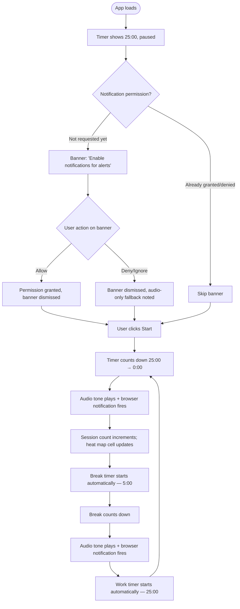
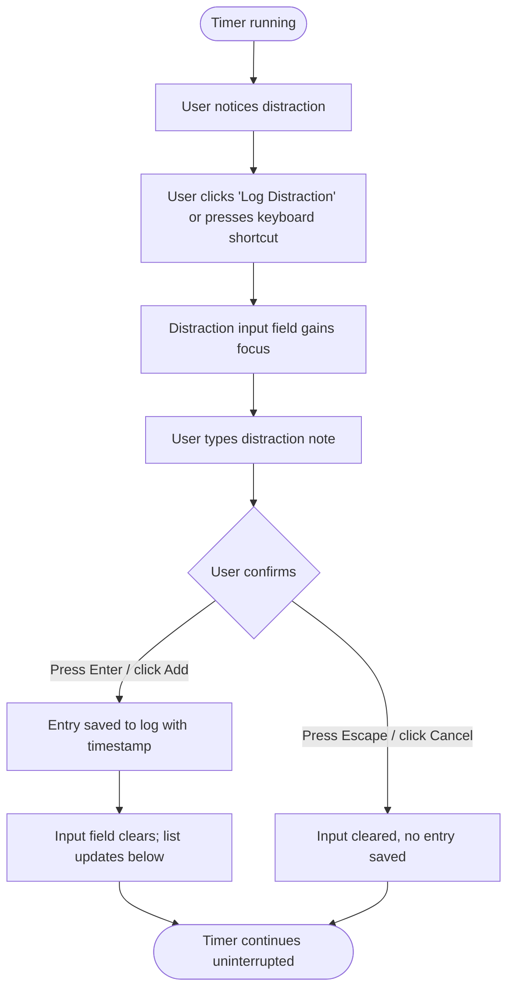
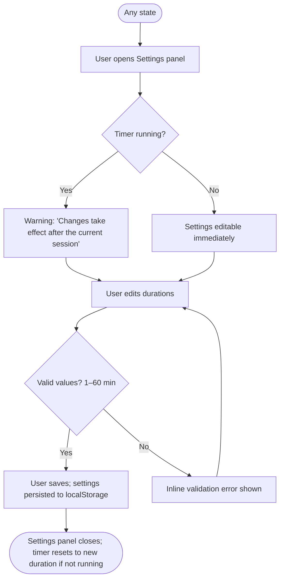
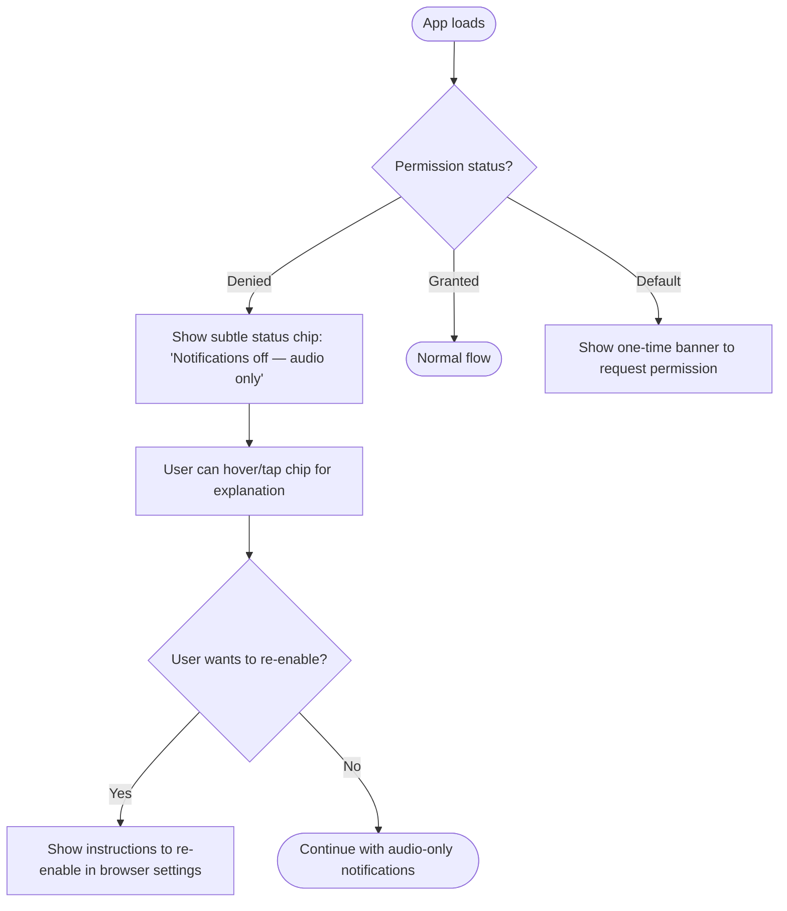

# UX Design: Pomodoro Timer with Analytics

**Status:** Draft  
**Author:** SDLC Pipeline  
**Date:** May 5, 2026  
**Version:** 1.0  
**Related PRD:** `prd_final.md`  
**Related Stories:** `epics_stories_final.md` (pending)

---

## 1. Overview
The Pomodoro Timer with Analytics is a single-page productivity application whose primary UX is centred on three areas visible simultaneously: the timer display, the productivity heat map, and the distraction log. The experience is intentionally calm and focused — the timer is the hero element, notifications arrive non-intrusively, and all secondary controls (settings, log entry) remain accessible without cluttering the main view. Users should be able to start a session in one click and never feel forced to navigate away from the core countdown.

## 2. User Goals
- **Primary goal:** Start a 25-minute focused work session with a single click, be notified when it ends, and have break transitions handled automatically — zero friction.
- **Secondary goals:**
  - See at a glance how productive the current day and week have been (heat map).
  - Capture fleeting distractions as quick notes without stopping the timer.
  - Occasionally adjust work/break durations to personal preference.

## 3. User Personas
| Persona | Description | Key Need |
|---------|-------------|----------|
| Focused Worker | Developer, writer, or student using the Pomodoro Technique to manage deep work | Reliable, distraction-free timer; clear session/break boundary |
| Habit Builder | User new to Pomodoro who wants to build a consistent routine | Visible progress (heat map) and motivational continuity across days |
| Interrupter | User in an environment with frequent interruptions | Quick distraction log entry without losing timer state |

## 4. User Flows

### Flow 1: First-Time Use — Happy Path

**Steps:**
1. App opens; timer displays `25:00` in paused state.
2. If notification permission has never been requested, a non-blocking banner prompts the user once.
3. User clicks **Start** — timer begins counting down.
4. At `0:00`: audio tone plays, browser notification fires (if permitted), session count increments on the heat map, break timer auto-starts.
5. At end of break: same transition back to work session.
6. Cycle repeats indefinitely until the user pauses or resets.

**Entry points:** Direct URL, browser bookmark.  
**Exit points:** User closes browser tab; user manually pauses and leaves the app.

---

### Flow 2: Distraction Log Entry During Session

**Steps:**
1. User observes a distraction mid-session.
2. Clicks the **+ Log** button (or presses a keyboard shortcut — e.g., `D`).
3. A compact text input appears below or beside the timer.
4. User types and presses **Enter** or clicks **Add**.
5. Entry is saved with the current timestamp; the input clears; the timer never pauses.

**Entry points:** Active work session only (log button disabled during break).  
**Exit points:** Returns focus to the timer; log entry is visible in the list.

---

### Flow 3: Customising Durations

**Steps:**
1. User opens the **Settings** panel (gear icon, always accessible).
2. If a session is running, a non-blocking warning states changes apply after the current session.
3. User adjusts work, short-break, and/or long-break durations.
4. Inline validation enforces 1–60-minute range.
5. User saves; settings are written to `localStorage`; panel closes.

**Entry points:** Gear icon in the header; accessible at any time.  
**Exit points:** Settings panel closes; timer reflects new duration at next session start.

---

### Flow 4: Notification Permission Denied

---

## 5. Key Interaction Patterns
| Interaction | Pattern | Notes |
|-------------|---------|-------|
| Start/Pause timer | Single prominent button toggles between Start and Pause | Button label changes dynamically; space bar also triggers |
| Reset timer | Secondary button; requires a confirmation nudge if session is in progress | Prevents accidental reset |
| Log distraction | Inline text input revealed on demand; dismissed with Enter or Escape | Never navigates away from timer |
| Open settings | Slide-in panel or modal; gear icon in header | Timer state unaffected while panel is open |
| Heat map cell hover | Tooltip showing date + session count | Keyboard-accessible via focus + aria-describedby |
| Session/break transition | Auto-advance; no user action needed | Animated ring or progress arc reinforces state change |
| Notification permission banner | One-time banner; dismissible; not a modal blocker | Shown only on first load if permission not yet decided |

## 6. States & Variations

### Timer Display
- **Default state (Idle):** Shows full duration (e.g., `25:00`), large and centred. **Start** button prominent. Session type label ("Work Session") visible.
- **Running state:** Countdown active; **Pause** button replaces **Start**; circular progress arc animates.
- **Paused state:** Time frozen; **Resume** and **Reset** buttons shown; progress arc held at current position.
- **Transitioning state:** Brief animation (e.g., flash, pulse) signals session end before new session begins.
- **Break state:** Timer and label clearly indicate "Short Break" or "Long Break"; different visual accent (e.g., cooler color tone for break vs. warm for work).

### Heat Map
- **Empty state:** Grid renders with all cells at zero-intensity (lightest shade). Tooltip on hover: "No sessions yet — start your first Pomodoro!". Label: "Your Productivity".
- **Populated state:** Cells colored by session count from lightest (0) to darkest (≥ 8 or max).
- **Today highlighted:** Today's cell has a subtle border or ring.
- **Error state:** If `localStorage` read fails, show a non-blocking message: "Unable to load history. Data will still be saved for this session."

### Distraction Log
- **Empty state (no entries):** Placeholder text: "No distractions logged yet. Stay focused!" Shown only when the log panel is expanded.
- **Active state:** List of timestamped entries; newest at top.
- **Input state:** Compact text field with **Add** and **Cancel** affordances.
- **Disabled state:** Log button greyed out during break session (logging only applies to work sessions).

### Settings Panel
- **Default state:** Displays current values for work, short break, and long break durations.
- **Editing state:** Input fields active; save button enabled when any value is changed.
- **Validation error state:** Inline error below offending field (e.g., "Must be between 1 and 60 minutes").
- **Saved state:** Brief success confirmation ("Settings saved") before panel closes.

## 7. Accessibility Considerations (WCAG 2.1 AA)
| Element | Requirement | Notes |
|---------|------------|-------|
| Keyboard navigation | All buttons, inputs, and heat map cells reachable via Tab/Shift-Tab | Logical DOM order; no keyboard traps |
| Focus indicators | Visible focus ring on all focusable elements | Use `:focus-visible` CSS; do not suppress outlines globally |
| Color contrast | Minimum 4.5:1 for timer digits and labels | Heat map color scale must maintain 3:1 min contrast for adjacent cell differentiation |
| Screen reader — timer | Live region (`aria-live="polite"`) announces session transitions | Avoid announcing every tick; only announce on state change |
| Screen reader — heat map | Each cell has `aria-label="[Date]: [N] sessions"` | Grid role or table semantics for row/column context |
| Screen reader — distraction log | New entries announced via `aria-live="polite"` | Avoid `aria-live="assertive"` to prevent interrupting user |
| Error messages | Validation errors use `role="alert"` and are not conveyed by color alone | Include error icon or text prefix "Error:" |
| Notification permission | Banner includes clear call-to-action text; not icon-only | "Enable browser notifications" with "Allow" and "Maybe later" buttons |
| Timer controls | Start/Pause button labeled with current action; icon buttons include `aria-label` | Label updates dynamically (`aria-label="Pause timer"` / `"Start timer"`) |
| Settings inputs | Each input has an associated `<label>` element | Do not rely solely on placeholder text |

## 8. Copy & Microcopy
| Element | Proposed Copy | Notes |
|---------|--------------|-------|
| Start button | **Start** | Changes to **Pause** when running |
| Pause button | **Pause** | Changes to **Resume** when paused |
| Resume button | **Resume** | |
| Reset button | **Reset** | Confirmation: "Reset this session?" if in progress |
| Work session label | **Work Session** | |
| Short break label | **Short Break** | |
| Long break label | **Long Break** | |
| Log distraction button | **+ Log Distraction** | Disabled during break with tooltip "Log available during work sessions" |
| Log input placeholder | **What distracted you?** | |
| Log add button | **Add** | |
| Log cancel | **Cancel** | |
| Heat map title | **Your Productivity** | |
| Heat map empty state | **No sessions yet — start your first Pomodoro!** | |
| Heat map cell tooltip | **[Day, Month DD]: [N] session(s)** | e.g., "Monday, May 5: 3 sessions" |
| Notification banner | **Get alerts when your session ends. Enable notifications?** | |
| Notification allow | **Allow** | |
| Notification dismiss | **Maybe later** | |
| Notification denied chip | **Notifications off — audio only** | Subtle, non-intrusive |
| Settings title | **Settings** | |
| Settings save button | **Save** | |
| Settings saved confirmation | **Settings saved** | Shown briefly, then panel closes |
| Validation error (duration) | **Must be between 1 and 60 minutes** | |
| Sessions today label | **Sessions today:** | Shown below heat map or beside timer |
| Long break prompt | **You've completed 4 Pomodoros! Take a long break?** | With **Start Long Break** and **Skip** buttons |
| Streak badge tooltip | **[N]-day streak! Keep it up.** | |

## 9. Edge Cases & Decision Points
| Scenario | Risk | Recommended Handling |
|----------|------|----------------------|
| User closes tab mid-session | Session incomplete; should NOT count | Only increment session count on natural `0:00` completion, not on close |
| User changes system clock manually | Timer could jump or become inaccurate | Use relative elapsed time (`Date.now() - startTime`); not affected by clock changes |
| Midnight boundary during session | Session starts on Day 1, ends on Day 2 | Record session to the day the timer reaches `0:00` |
| Notification permission denied after initial grant | Browser revocation | Re-check permission on each session start; gracefully fall back to audio |
| localStorage unavailable (private browsing) | Data won't persist | Wrap all storage calls in try/catch; show non-blocking warning "History won't be saved in private mode" |
| Very long sessions in background tabs | Browser may throttle intervals aggressively | Drift correction via `Date.now()` timestamps handles this correctly |
| User reloads page during session | Session in-progress is lost | On load, check if a session was in-progress (store start time in localStorage); optionally offer to resume |
| Distraction log filled with many entries | Visual overflow | Limit visible entries to 5–10 with a "Show all" toggle; entries scrollable |
| User sets duration to maximum (60 min) | Timer may feel unresponsive | No special handling needed; drift correction keeps it accurate |
| Settings changed while timer is running | New duration should not interrupt current session | Apply changes at next session start; show info message to the user |
