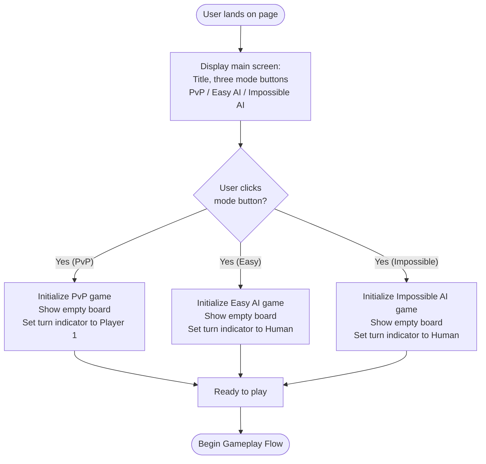
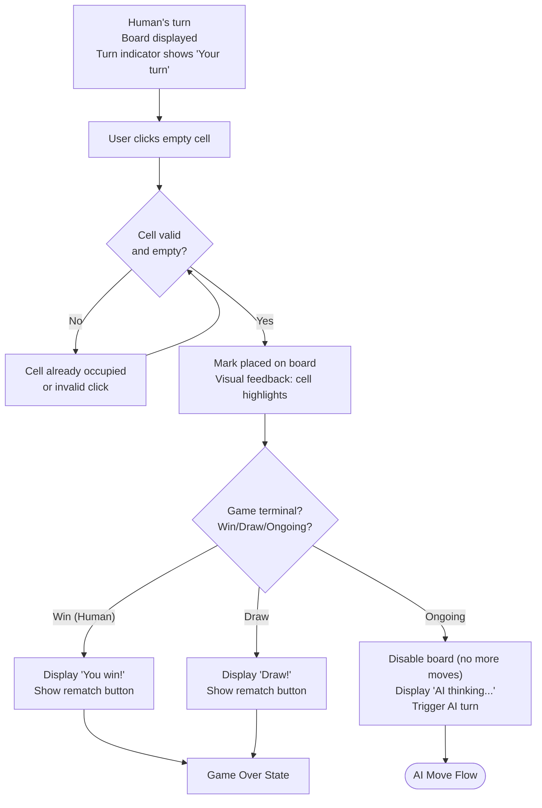
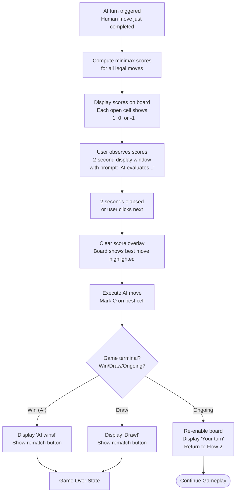
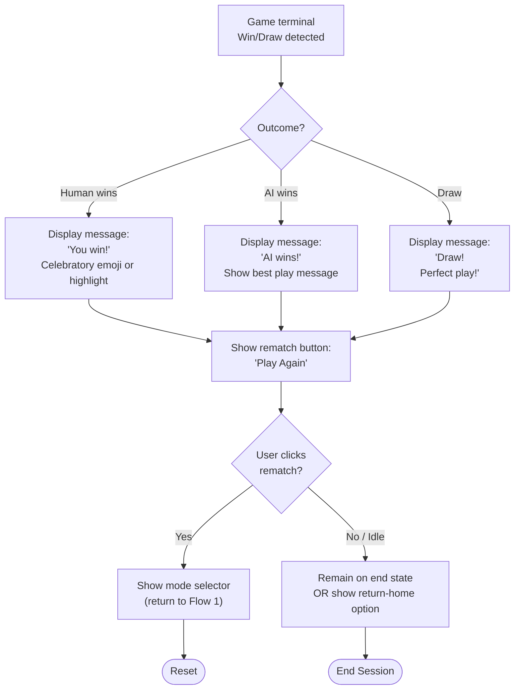
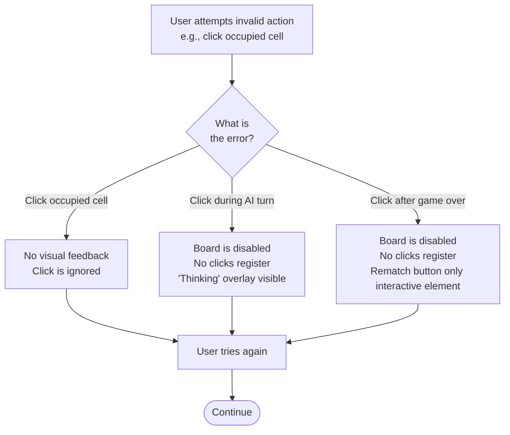

# UX Design: B3 Tic-Tac-Toe with Unbeatable AI

**Status:** Final  
**Author:** UX Design Team  
**Date:** 2026-05-06  
**Version:** 1.0  
**Related PRD:** [prd_final.md](prd_final.md)  
**Related Architecture:** [architecture_final.md](architecture_final.md)

---

## 1. Overview
The Tic-Tac-Toe game provides three play modes to accommodate different user needs: casual two-player matches, easy single-player gameplay, and an impossible AI challenge with transparent move evaluation. The UX prioritizes clarity, immediate feedback, and the learning opportunity to see why the AI makes its choices through minimax score visualization. The flow is streamlined to minimize decision points and get users to gameplay quickly.

---

## 2. User Goals

- **Primary goal:** Play a quick, engaging Tic-Tac-Toe game against a human opponent or AI.
- **Secondary goals:**
  - Understand how the minimax algorithm works by observing AI decision-making.
  - Challenge oneself against an unbeatable AI and achieve a draw.
  - Teach others about game theory and AI decision-making.

---

## 3. User Personas

| Persona | Description | Key Need |
|---------|-------------|----------|
| **Casual Player** | Wants quick entertainment; plays solo or with friend. Plays 1–3 games per session. | Fast mode selection; clear win/loss messaging; rematch button. |
| **Learner / Algorithm Enthusiast** | Interested in AI and game theory; studies the minimax scores. Plays 5+ games per session. | Score visualization; multiple plays against Impossible AI to observe patterns. |
| **Educator** | Uses game to teach algorithms or strategy to students. | Clear score display; stable gameplay; ability to explain decisions. |

---

## 4. User Flows

### Flow 1: Happy Path — Game Initialization and Mode Selection

**Steps:**
1. Application loads; display full-screen mode selector with three equally prominent buttons.
2. User clicks one of three mode buttons.
3. Board initializes as empty 3×3 grid.
4. Turn indicator displays whose turn it is (or if AI is playing).

**Entry points:** App load; after game reset.
**Exit points:** User enters gameplay (Flow 2).

---

### Flow 2: Happy Path — Gameplay (Human Move)

**Steps:**
1. Human player sees empty board with clear turn indicator: "Your turn."
2. Player clicks an empty cell (visual hover state shows this cell is clickable).
3. Board validates the move; if cell is occupied, no change (no error message needed—click simply has no effect).
4. Valid move is placed on board; cell highlights briefly as visual feedback.
5. Game state updates; check for win or draw.
6. If game ongoing, board temporarily disables (visual fade or overlay), and "AI thinking..." message displays.
7. AI move is executed (see Flow 3).

**Entry points:** After mode selection; after rematch.
**Exit points:** Game end (Flow 4) or AI turn (Flow 3).

---

### Flow 3: AI Move — Impossible Mode with Score Visualization

**Steps:**
1. After human move, AI enters decision phase.
2. Minimax algorithm computes scores for all 9 cells (max ~549,946 evaluations, pruned by alpha-beta).
3. Score overlay is drawn on the board:
   - Each empty cell displays its score: **+1** (AI win), **0** (draw), **−1** (human win).
   - Colors: Green for +1, Yellow for 0, Red for −1 (accessible colors chosen for deuteranopia/protanopia).
4. Display remains for 2 seconds with label "AI is thinking..." to allow player observation.
5. After 2 seconds, overlay clears and best move is executed (no option to interrupt).
6. AI mark (O) is placed on board.
7. Game state updated; check for AI win or draw.
8. If game ongoing, return to human turn; if terminal, show game-over message.

**Entry points:** After human move in ongoing game.
**Exit points:** Game end or return to human turn.

---

### Flow 4: Game Over — End State and Rematch

**Steps:**
1. Game logic detects win, loss, or draw.
2. Game board is disabled (no further moves allowed).
3. Clear message displayed at bottom or center of board (e.g., "You win!", "AI wins!", "Draw!").
4. Rematch button appears below board with label "Play Again" or "New Game".
5. Optional: Show "Return to Mode Select" button if user wants to switch modes.
6. If user clicks rematch, reset board and mode selector; return to Flow 1.
7. If user closes/leaves page or goes idle, session ends.

**Entry points:** Winning move made by human or AI; board full with no winner.
**Exit points:** New game (Flow 1) or session end.

---

### Flow 5: Error State — Invalid Interaction

**Steps:**
1. User attempts an invalid action (click occupied cell, click during AI turn, click after game end).
2. **No error message is shown** — interactions are silently ignored or board is disabled with visual feedback.
3. User retries by clicking a valid cell.
4. Valid move is processed.

**Rationale:** Tic-Tac-Toe is simple enough that a silent ignore (instead of error dialog) keeps UX clean. Visual affordances (disabled board state) prevent confusion.

**Entry points:** User mistake.
**Exit points:** Valid action or navigation away.

---

## 5. Key Interaction Patterns

| Interaction | Pattern | Notes |
|-------------|---------|-------|
| Mode selection | Radio-button-like mutually exclusive buttons | Three buttons; click selects one; board initializes. |
| Cell click | Direct manipulation; visual feedback (highlight/press) | Click empty cell to place mark. Click has no effect on occupied cells. |
| Score display | Temporary overlay on board | Scores appear for 2 seconds before AI moves in Impossible mode; non-interactive. |
| Turn indicator | Text label at top or side of board | E.g., "Your turn" or "AI thinking..." Changes with each turn. |
| Rematch / Reset | Single clear button at bottom | Large, high-contrast button that resets board and shows mode selector. |
| Responsive feedback | Cell highlight on hover (desktop) or on click (mobile) | Visual confirmation that cell is selectable before commit. |

---

## 6. States & Variations

### Main Screen (Mode Selector)
- **Default state:** Three mode buttons displayed; large, equal-width, clearly labeled.
- **Hover state (desktop):** Button background changes slightly; cursor shows "pointer."
- **Active state:** Button is pressed; mode initializes immediately.
- **Disabled state:** (Not applicable—all modes always available.)

### Game Board
- **Empty state:** All 9 cells empty; turn indicator shows "Your turn" (or AI intro message).
- **In-play state:** Some cells filled with X or O; turn indicator updates; hovered cells show visual affordance.
- **Score overlay state (Impossible AI only):** Scores (+1, 0, −1) displayed on empty cells; board is disabled for interaction; label says "AI thinking...".
- **End state:** Board is full or winning condition met; message displayed (e.g., "You win!"); all cells disabled; rematch button shown.

### Turn Indicator
- **Text display:** "Your turn" (human), "AI thinking..." (AI processing), "AI's turn" (Easy AI making random move).
- **Visual clarity:** Large, readable font; positioned at top or bottom; high contrast to background.

### Individual Cell
- **Empty state:** Light background; clickable.
- **Hover state:** Darker background or slight elevation (desktop).
- **Filled state (X or O):** Mark displayed clearly; not clickable.
- **Score state:** Shows score (−1, 0, +1) with icon or number; temporary (Impossible AI only).

---

## 7. Accessibility Considerations (WCAG 2.1 AA)

| Element | Requirement | Implementation |
|---------|------------|-----------------|
| **Keyboard navigation** | All interactive elements (mode buttons, cells, rematch button) reachable via Tab key. | Tabindex management; buttons are native HTML `<button>` elements. |
| **Focus indicators** | Visible focus ring on all buttons and clickable cells; minimum 2px outline. | CSS `:focus-visible` with high-contrast color (e.g., white or bright border). |
| **Color contrast** | Minimum 4.5:1 for normal text; 3:1 for large text. Score colors accessible to color-blind users. | Test with WebAIM contrast checker; use accessible palette (no pure red/green). |
| **Score colors** | Scores indicated by color *and* symbol/number, not color alone. | +1 = Green + "+" symbol; 0 = Yellow + "0"; −1 = Red + "−" symbol. |
| **Screen reader** | Meaningful alt text for interactive elements; ARIA labels for status messages. | `aria-label` on cells: "Row 1, Column 1, empty"; status messages in live region (`aria-live="polite"`). |
| **Error messages** | Errors identified in text, not by visual style alone. | Errors silently ignored; board disables with overlay label. No error dialog. |
| **Responsive text** | Text is readable at 200% zoom; no text overflow. | Font-relative units (rem/em); viewport settings for mobile. |
| **Touch targets** | Minimum 44×44 px for interactive elements. | Cells sized appropriately; buttons at least 44×44 px. |
| **Semantic HTML** | Use native `<button>`, `
`, etc. | Avoid generic `
` with click handlers; use semantic elements. |

---

## 8. Copy & Microcopy

| Element | Proposed Copy | Notes |
|---------|--------------|-------|
| **Page title** | "Tic-Tac-Toe with AI" | Clear, descriptive; helps with browser tab. |
| **Mode selector heading** | "Choose a mode to start" | Friendly, action-oriented. |
| **PvP button** | "Player vs. Player" | Clear two-player mode. |
| **Easy AI button** | "Play Easy AI" | Friendly; signals beatable opponent. |
| **Impossible AI button** | "Play Impossible AI" | Clear challenge signal; implies AI will not lose. |
| **Turn indicator (human)** | "Your turn" | Simple, direct. |
| **Turn indicator (AI thinking)** | "AI is thinking..." | Reassuring; explains why board is inactive. |
| **Turn indicator (PvP)** | "Player 1's turn" or "Player 2's turn" | Clear alternation. |
| **Win message (human)** | "You win! 🎉" | Celebratory; emoji optional but enhances friendliness. |
| **Win message (AI)** | "AI wins! Well played." | Graceful; acknowledges player effort. |
| **Draw message** | "Draw! Perfect play." | Encouraging; suggests both sides played optimally. |
| **Rematch button** | "Play Again" | Clear next action. |
| **Home button** | "Choose Mode" or "Main Menu" | Returns to mode selector. |
| **Score label (during AI thinking)** | "AI evaluates:" | Explains score display; educates. |

---

## 9. Edge Cases & Decision Points

| Scenario | Risk | Recommended Handling |
|----------|------|----------------------|
| **User clicks cell during AI move** | Confusion if click registers unexpectedly. | Board disabled with visual overlay during AI thinking; click has no effect. Cursor changes to "not-allowed" to signal disabled state. |
| **AI takes >2 seconds to move** | User perceives game as frozen. | Display "Calculating..." spinner; accept 2–5 second latency as normal. |
| **User spams rematch button** | Multiple games initialized at once. | Button disabled after first click until game resets. |
| **Mobile touch interaction** | Accidental double-tap or mis-touch. | Implement touch debounce; highlight cell on touch with 200ms feedback before commit. |
| **Score display overlaps with marks** | Scores hard to read if cells already have marks (shouldn't happen, but visual clutter risk). | Scores only display on *empty* cells; never on cells with X or O. |
| **Color-blind user cannot distinguish scores** | Scores shown by color alone (failure). | Scores use number *and* color; test with color-blind simulator. |
| **User navigates away mid-game** | Game state lost; user loses progress. | No persistent storage needed for MVP; session loss is acceptable. |
| **Screen too small for board** | Board doesn't fit; cells unclickable. | Responsive design; cells scale down but remain ≥44×44 px; board may scroll on very small screens. |

---

## 10. Open Questions & Assumptions

- **Assumption:** Users are familiar with Tic-Tac-Toe rules and do not need a tutorial.
- **Assumption:** Minimax scores are educational; users appreciate seeing +1/0/−1 values.
- **Assumption:** 2-second score display is adequate observation time; user can replay game if needed.
- **Open question:** Should there be a help or rules link? _(Recommend: No for MVP; defer to v2 if needed.)_
- **Open question:** Should scores remain visible after AI move, or clear immediately? _(Recommend: Clear immediately for clean board.)_
- **Open question:** Should Easy AI have a slight delay before moving, or move instantly? _(Recommend: 500ms delay to feel like a thinking opponent.)_
- **Open question:** Should PvP mode require explicit player switching (e.g., "Player 1, press OK to pass to Player 2") or just show turn indicator? _(Recommend: Turn indicator only; players know to pass device.)_

---

## 11. Out of Scope

- **Game history or replay:** Games are single-session; no persistent data.
- **Tutorial or rules explanation:** Assume users know Tic-Tac-Toe; defer educational content to v2.
- **Settings or difficulty knobs:** All modes fixed (Easy AI is always random; Impossible AI always minimax).
- **Multiplayer online:** Single-device play only.
- **Sound effects or animations (beyond visual feedback):** Minimize audio for accessibility; defer animation details to design phase.
- **Mobile-specific gestures:** Support standard touch; no swipe gestures or custom interactions.

---

## 12. Appendix

**Related Documentation:**
- [prd_final.md](prd_final.md) — Product requirements and success criteria.
- [architecture_final.md](architecture_final.md) — Technical component design and minimax algorithm detail.

**Accessibility Resources:**
- [WCAG 2.1 Guidelines](https://www.w3.org/WAI/WCAG21/quickref/) — Reference for accessibility standards.
- [WebAIM Contrast Checker](https://webaim.org/resources/contrastchecker/) — Test color contrast ratios.
- [Accessible Colors for Color Blind](https://colourblindawareness.org/) — Palette guidance.

**UX Best Practices:**
- Norman, D. (2013). *The Design of Everyday Things.* — Error prevention and clear feedback.
- Nielsen, J. (1993). *Usability Engineering.* — User testing and iterative design.

**Prior Art:**
- [lichess.org Tic-Tac-Toe example](https://lichess.org) — Inspiration for clean board UI (for chess, but transferable).
- [Classic online Tic-Tac-Toe games](https://www.google.com/search?q=online+tic+tac+toe) — Reference implementations.
