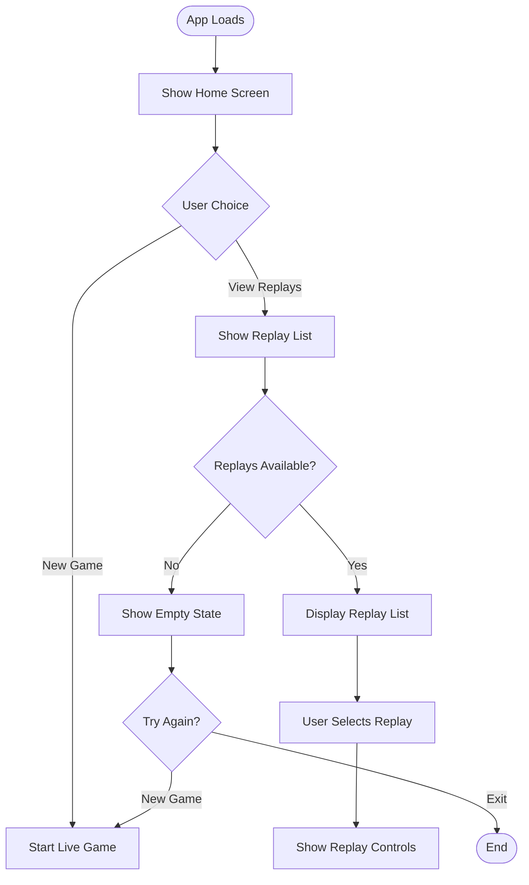
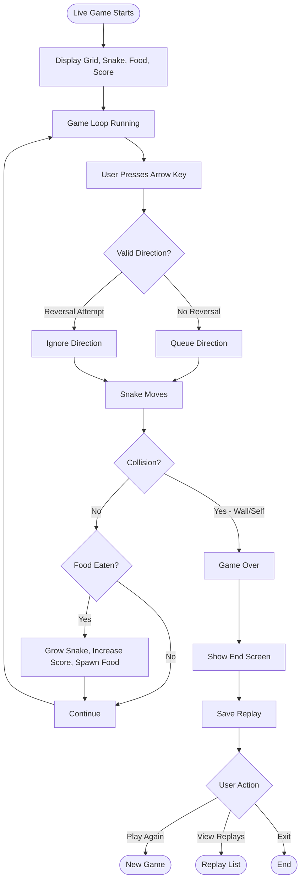
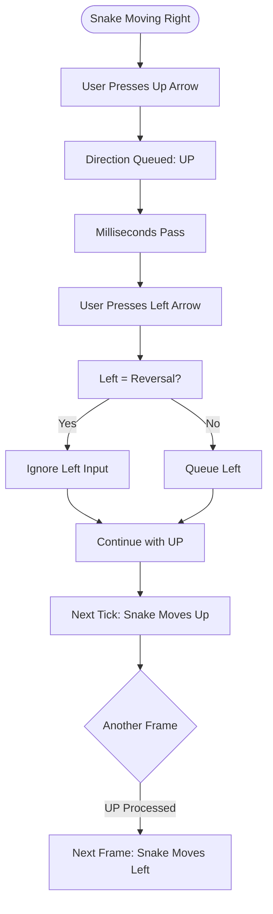
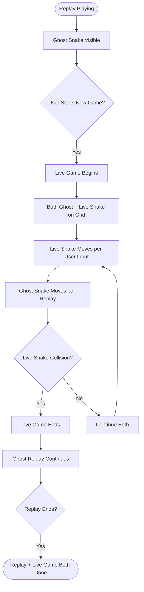
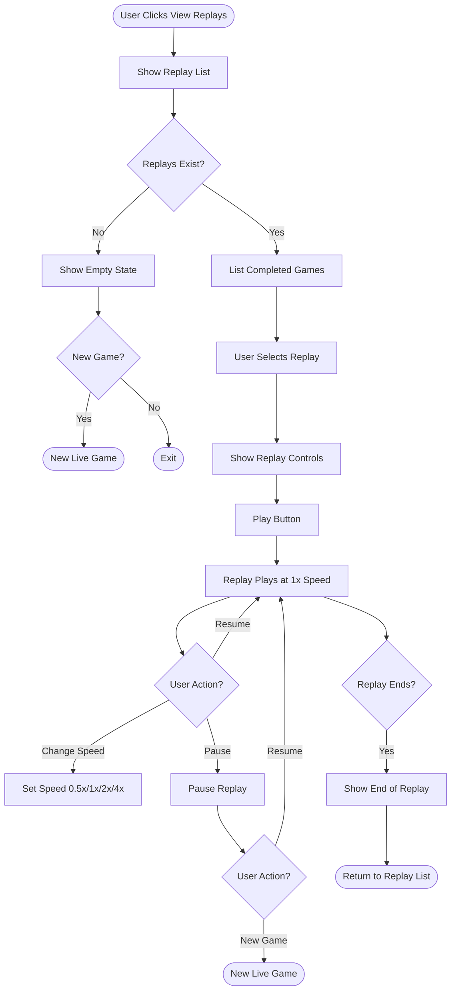
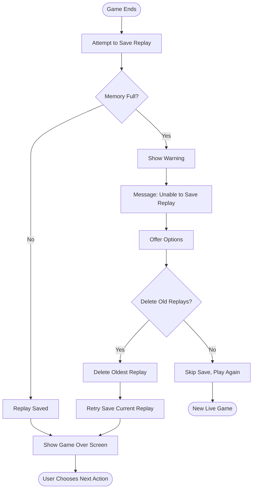

# UX Design: Snake with Replay System

**Status:** Draft  
**Author:** SDLC Pipeline  
**Date:** May 6, 2026  
**Version:** 1.0  
**Related PRD:** [prd_final.md](prd_final.md)  
**Related Architecture:** [architecture_final.md](architecture_final.md)

---

## 1. Overview
The Snake with Replay System provides a single-player arcade experience where users play Snake with arrow key controls, track their score, and watch replays of prior games at variable speeds. The UX prioritizes responsive gameplay, clear visual feedback, and intuitive access to replay history. Users must be able to instantly switch between live play and replay viewing, with ghost snakes rendered distinctly from live snakes to avoid confusion.

---

## 2. User Goals

- **Primary goal:** Play Snake and improve score through repeated attempts.
- **Secondary goals:**
  - Review past gameplay via replay to learn from mistakes.
  - Compare live play against a ghost replay to practice specific strategies.
  - Understand current game state at a glance (score, snake length, food location).

---

## 3. User Personas

| Persona | Description | Key Need |
|---------|-------------|----------|
| **Casual Gamer** | Seeks quick, engaging arcade play; plays in short bursts | Fast feedback; simple controls; visible score |
| **Practice Player** | Plays repeatedly to improve; analyzes replays | Access to replay history; easy replay navigation; speed controls |
| **Competitive Player** | Tracks personal bests; compares performances | Clear scoring; replay comparison (live vs. ghost) |

---

## 4. User Flows

### Flow 1: Initial App Load & Game Selection

_The user opens the application and must choose to start a new game or select a replay._

**Steps:**
1. User opens `index.html` in browser
2. App initializes and displays home screen with two options: "Play" and "View Replays"
3. If user clicks "Play," live game begins immediately
4. If user clicks "View Replays," app shows list of available replays (or empty state if none exist yet)
5. User selects a replay and is presented with replay playback controls (Play, Pause, Speed selector)

**Entry points:** App load  
**Exit points:** Game start (live), replay playback, or exit

---

### Flow 2: Live Game — Happy Path

_User plays a complete game from start to end._

**Steps:**
1. Game grid initializes with snake at center, food at random location
2. Game loop runs at fixed tick rate; snake moves based on buffered direction
3. User presses arrow keys; each valid input queues a direction change
4. Directional reversal logic prevents two-key sequence from reversing snake
5. Snake moves; collision detection runs
6. If food eaten: snake grows, score increases, new food spawns, speed increases slightly
7. If collision: game ends, replay is saved automatically
8. End screen shows final score and options to play again, view replays, or exit

**Entry points:** User clicks "Play" on home screen  
**Exit points:** Game over → user chooses next action

---

### Flow 3: Live Game — Input Edge Case (Rapid Key Press)

_User presses two arrow keys in rapid succession. The second key must not reverse the snake's current direction._

**Steps:**
1. Snake is moving right
2. User presses up arrow; direction is buffered
3. User immediately presses left arrow
4. Input handler detects left is a reversal of current direction (right)
5. Left input is discarded; up direction executes on next game tick
6. If user intended to move left, they can press left again after the up move completes

**Key assumption:** Reversal prevention checks current snake direction, not the queued direction.

---

### Flow 4: Live Game with Simultaneous Replay

_User starts a new live game while a replay is playing._

**Steps:**
1. Replay is running; ghost snake is visible on grid as semi-transparent overlay
2. User presses play/starts new game; live game begins on same grid
3. Both snakes are rendered; live snake is opaque, ghost is semi-transparent
4. Live snake moves based on user input; ghost snake follows replay sequence
5. If live snake collides, live game ends; ghost replay continues unaffected
6. If replay ends first, only live game remains
7. When both are complete, user sees end screen for live game only

**Key interaction:** Ghost snake has no collision logic with live snake; it is purely visual.

---

### Flow 5: Replay Selection & Playback

_User selects a completed game from the replay list and plays it back._

**Steps:**
1. User clicks "View Replays" button
2. If replay list is empty, show empty state with encouragement to play
3. If replays exist, display list with game metadata (score, date/time, duration)
4. User clicks a replay; replay loads and controls appear (Play, Pause, Speed selector)
5. User clicks Play; ghost snake retraces the recorded game
6. User can change speed during playback; speed change is instant (no re-buffering needed)
7. User can pause at any time; pausing freezes ghost snake on grid
8. When replay ends, show a summary and offer to play again or start new game
9. User can exit replay and return to list at any time

**Entry points:** Home screen "View Replays" button  
**Exit points:** Start new game, return to home, or exit app

---

### Flow 6: Game Over with Error (Rare — Session Storage Full)

_In an unlikely scenario where the browser's in-memory storage is full, the replay cannot be saved._

**Steps:**
1. Game ends normally
2. Replay is serialized and stored in memory
3. If memory limit reached (unlikely), show non-blocking warning
4. Offer user option to delete oldest replays to make room
5. If user agrees, delete oldest replay and retry
6. If user declines, allow game to proceed without saving this replay
7. Show game over screen with score and options

---

## 5. Key Interaction Patterns

| Interaction | Pattern | Notes |
|-------------|---------|-------|
| Arrow key input | Real-time queue buffering; directional change on next tick | Prevents reversals; smooth for rapid input |
| Replay speed control | Dropdown or buttons (0.5×, 1×, 2×, 4×) | Instant change; no frame re-buffering |
| Pause/resume | Spacebar or button toggle | Freezes game/replay at current frame |
| Replay list selection | Click to select; highlights selected row | Visual feedback on selection |
| Start new game | Button on home screen or end screen | Instant initialization |
| View replays | Button on home screen or after game end | Shows replay list |
| Ghost overlay | Rendered at reduced opacity; distinct color | Visually separates from live snake |

---

## 6. States & Variations

### Main Screen

- **Home State:** Menu with "Play" and "View Replays" buttons, app title, instructions
- **Loading State:** N/A (no async operations in MVP)
- **Empty State:** (See "Replay List — Empty State")
- **Error State:** (See Flow 6 for rare memory error)

### Game Board

- **Default State (Playing):** Grid visible, snake in motion, food present, score displayed, snake color opaque
- **Paused State:** Grid frozen; snake in current position; "PAUSED" label overlaid; input disabled except pause toggle
- **Game Over State:** Grid grayed out or frozen; "GAME OVER" label; final score; options for replay/play again
- **Empty State:** N/A (grid always has snake and food)
- **Loading State:** N/A (no server calls)
- **Replay Overlay (Ghost Snake):** Semi-transparent snake with distinct color (e.g., light gray or dotted outline) renders on same grid as live snake

### Replay List

- **Default State:** Table/list of completed games with columns: Score, Date, Duration, Action (Play)
- **Empty State:** Message: "No replays yet. Play a game to create one!" with "Play Now" button
- **Loading State:** N/A (replays loaded from memory)
- **Selected State:** Selected replay row highlighted; controls appear below (Play, Pause, Speed)

### Replay Playback Controls

- **Default State (Before Play):** Buttons: Play, Speed Selector (1×), Back to List
- **Playing State:** Buttons: Pause, Speed Selector (current speed), Back to List
- **Paused State:** Buttons: Resume, Speed Selector (current speed), Back to List
- **Ended State:** Message "Replay ended"; buttons: Restart, Back to List

---

## 7. Accessibility Considerations (WCAG 2.1 AA)

| Element | Requirement | Notes |
|---------|------------|-------|
| **Keyboard Navigation** | All controls reachable via Tab; no keyboard traps | Arrow keys control snake; Tab/Enter/Space for buttons |
| **Focus Indicators** | Visible focus ring on all buttons, replay list items, speed selector | Use browser default or custom visible indicator (min 2px) |
| **Color Contrast** | Text on background: 4.5:1; UI elements: 3:1 minimum | Avoid relying on color alone for snake vs. ghost distinction |
| **Screen Reader (ARIA)** | List items have role; button labels clear; game state announced | "Game Over: Final Score 42"; "Replay paused at 30 seconds" |
| **Ghost/Live Distinction** | Use color + pattern/opacity; not color alone | Live: solid green; Ghost: dashed gray or light blue |
| **Error Messages** | Text-based error alerts; not color-coded only | "Error: Unable to save replay. Try deleting old ones." |
| **Dynamic Content** | Live score updates announced via aria-live region | `
Score: 42
` |
| **Canvas Fallback** | Alt text for canvas; native button controls outside canvas | `<canvas role="img" aria-label="..."></canvas>` |

---

## 8. Copy & Microcopy

| Element | Proposed Copy | Notes |
|---------|--------------|-------|
| **App Title** | "Snake with Replay System" | Clear, descriptive |
| **Play Button** | "Play" | Single word; action-oriented |
| **View Replays Button** | "View Replays" | Clear intent |
| **Pause Button** | "Pause" or icon (⏸) | Toggle verb |
| **Resume Button** | "Resume" or icon (▶) | Clear action |
| **Speed Selector Label** | "Speed" | Followed by options 0.5×, 1×, 2×, 4× |
| **Game Over Modal** | "Game Over" heading; "Final Score: [X]" | Clear end state |
| **Play Again Button** | "Play Again" | Action-oriented; obvious next step |
| **Back to List Button** | "Back to Replays" | Clear navigation |
| **Empty Replay State** | Heading: "No Replays Yet"; Subtext: "Play a game to create one!" | Encouraging; actionable |
| **Error: Memory Full** | "Replays storage full. Delete old replays?" | Conversational; clear options |
| **Replay Ended** | "Replay ended" | Simple confirmation |
| **Score Label** | "Score: [X]" | Always visible during play |
| **Food Indicator** (if needed) | Visual only (colored square on grid) | No label needed; learned through play |

---

## 9. Edge Cases & Decision Points

| Scenario | Risk | Recommended Handling |
|----------|------|----------------------|
| **User presses two opposing keys simultaneously (e.g., Left + Right)** | Confusion; unintended direction | Only queue last key pressed; ignore simultaneous presses. Prev direction wins. |
| **User mashes keys while snake moving slowly** | Input queue overflows; missed inputs | Buffer only next 1–2 inputs; discard older buffered inputs beyond 2 deep |
| **User pauses game, then closes app tab** | Replay not saved? | Replay saved only on natural game over, not on pause. Clear in UI. |
| **Replay finishes while user is still in live game** | Unclear what happened | Show "Replay ended" label near ghost snake; allow live game to continue |
| **User tries to start two replays simultaneously** | Unclear which one plays | Disable "Play" button once replay is active; show "Stop Replay" button instead |
| **User plays extremely slowly; replay takes 10 minutes** | Memory strain; frame drops | Optimized rendering; test with max-size replays. Likely not an issue at 0.5× speed. |
| **User starts new game while replay at 4× speed** | Tempo mismatch; confusing | Live game always runs at normal 1× game speed; replay overlays at selected speed independently |
| **Food spawns on ghost snake in early frames** | Visual confusion | Food spawns only in empty cells; check against live snake only, not ghost. Ghost is overlay only. |
| **User forgets arrow keys; tries WASD or mouse** | No feedback; frustration | Display on-screen arrow key hints; consider WASD as stretch goal (out of MVP) |

---

## 10. Open Questions & Assumptions

- **Assumption:** Users are familiar with classic Snake rules (eat food, grow, avoid collision).
- **Assumption:** Arrow keys are the primary input method; alternative input (WASD, mouse) is stretch goal.
- **Assumption:** Replay list persists only for the current session; no localStorage in MVP.
- **Assumption:** Grid is always 20×20; user cannot adjust.
- **Assumption:** Speed progression is automatic; user cannot adjust snake speed during live play.
- **Open question:** Should the app have a fullscreen mode? (Answer: Not in MVP; can add later)
- **Open question:** Should we display estimated game duration in replay list? (Answer: Optional for MVP; can add if time permits)
- **Open question:** Should failed collision due to simultaneous key press show a message? (Answer: No; just silently ignore; users learn quickly)

---

## 11. Out of Scope

- Sound effects or music
- Mobile touch controls (keyboard only)
- Multiplayer or social features
- Leaderboards or score sharing
- Custom grid sizes
- Difficulty levels or settings
- AI autopilot mode
- Persistent storage across sessions (localStorage, server)
- Replay URL sharing or encoding

---

## 12. Appendix

### Related Documents
- **PRD:** [prd_final.md](prd_final.md)
- **Architecture:** [architecture_final.md](architecture_final.md)
- **Requirements:** [Requirements 1.md](Requirements%201.md)
- **Expected Outcomes:** [Expected-Outcomes 1.md](Expected-Outcomes%201.md)

### Design Principles
1. **Clarity:** Game state is always immediately obvious (score, ghost vs. live, pause status)
2. **Responsiveness:** Input feedback is instant; no lag between key press and on-screen movement
3. **Simplicity:** Minimal UI chrome; focus on the game board
4. **Accessibility:** Keyboard-first; no hover-dependent interactions; screen reader friendly

### Interaction Guidelines for Developers
- All buttons should have a visible focus indicator (outline or background change)
- Arrow key input should be captured and buffered; no default browser scroll behavior
- Ghost snake rendering should use canvas composite modes (opacity ~0.5) for clarity
- Live game and replay timing are independent; replay runs in separate game loop with speed multiplier
- End screen should appear 500ms after collision (brief pause for visual clarity)
