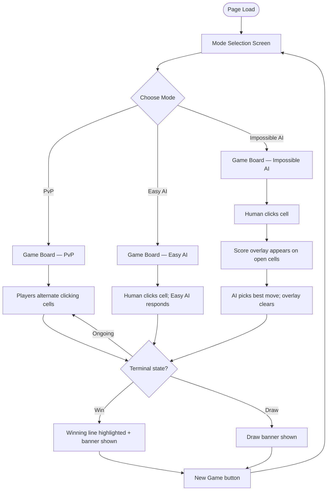
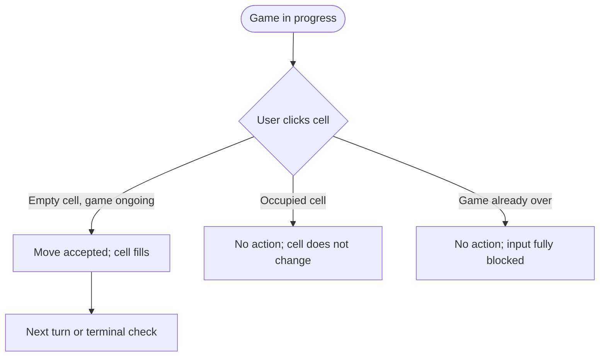
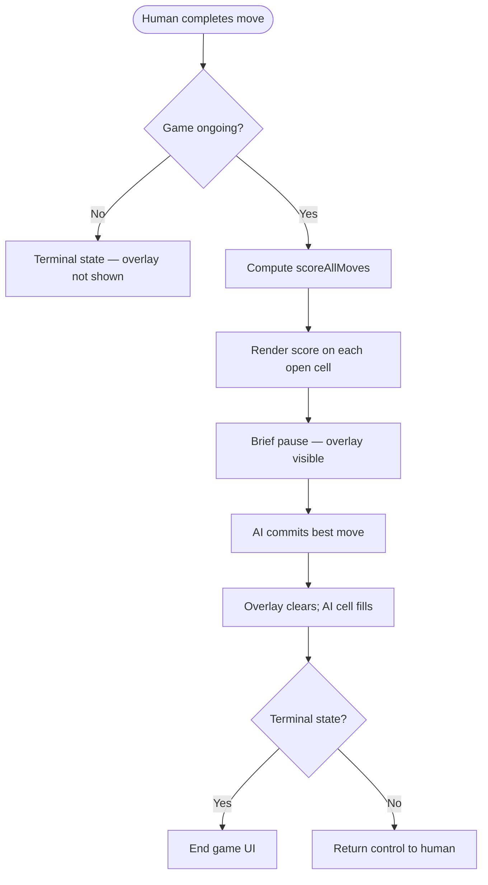

# UX Design: Tic-Tac-Toe with Unbeatable AI

**Status:** Draft
**Author:** [TBD]
**Date:** May 5, 2026
**Version:** 1.0
**Related PRD:** `prd_final.md`
**Related Stories:** `epics_stories_final.md` (pending)

---

## 1. Overview

A single-page Tic-Tac-Toe game with three modes. The user experience centres on two moments of delight: the satisfying simplicity of a 3×3 grid for casual play, and the uniquely transparent "Impossible AI" mode that shows the minimax evaluation score on every open cell before the AI moves — turning the game into a learning tool. The interface is minimal, responsive, and fully operable by keyboard.

---

## 2. User Goals

- **Primary goal:** Play a complete game of Tic-Tac-Toe against a chosen opponent (human or AI) and see a clear outcome.
- **Secondary goals:**
  - Understand *why* the AI made a particular move by reading the score overlay.
  - Start a new game quickly without losing the chosen mode.
  - Play comfortably on both desktop and mobile.

---

## 3. User Personas

| Persona | Description | Key Need |
|---------|-------------|----------|
| Casual Player | Plays for fun, wants quick rounds | Fast mode selection, immediate feedback, easy new-game restart |
| Learner | Studying minimax / game AI | Score overlay legible and meaningful; AI always behaves correctly |
| Developer / Educator | Using as a reference implementation | Correct behaviour across all game states; clean, predictable UI |

---

## 4. User Flows

### Flow 1 — Happy Path: Start and Complete a Game

**Steps:**
1. User arrives at the page and sees the mode selection screen.
2. User picks a mode by clicking/tapping one of three buttons.
3. The board appears. Turn indicator shows whose turn it is.
4. User clicks an empty cell. The X or O appears instantly.
5. If Impossible AI mode: score overlay appears on all remaining open cells, then AI places its O and overlay clears.
6. If Easy AI mode: AI places O in a random empty cell.
7. After each move, terminal state is checked. If a win or draw is detected, the game halts.
8. Winning line is highlighted. A status banner announces the result.
9. User clicks "New Game" to return to mode selection.

**Entry points:** Direct page load; "New Game" button after a completed game.
**Exit points:** Browser navigation away from the page.

---

### Flow 2 — Edge Case: Attempting to Click an Occupied or Locked Cell

**Steps:**
1. User clicks a cell that is already filled (X or O).
2. No state change occurs. No error message is needed — the visual presence of the symbol is sufficient feedback.
3. If the game is in a terminal state, all cells are inert. The cursor changes to `default` (not `pointer`) to signal no interaction is possible.

---

### Flow 3 — Score Overlay During Impossible AI Turn

**Steps:**
1. Human places X. Game checks for terminal state — none found.
2. Score overlay renders: each open cell shows its minimax score (−1, 0, or +1).
3. A short, perceptible pause (100–200 ms recommended) allows the user to read scores before the AI moves.
4. AI places O in the highest-scoring cell. Overlay clears.
5. Game checks terminal state again.

**Assumption:** The pause duration is a UI-layer constant, not a game logic concern.

---

## 5. Key Interaction Patterns

| Interaction | Pattern | Notes |
|-------------|---------|-------|
| Mode selection | Three clearly labelled buttons; selected mode highlighted | No dropdowns — three options fit inline |
| Placing a move | Click / tap on an empty cell | Cursor is `pointer` on hover for empty cells, `default` for filled or game-over |
| Score overlay display | Numeric score centred in the cell below the symbol area | Scores are small and muted so they don't dominate; cell symbol takes visual priority |
| Game over feedback | Winning three cells get a visual treatment (e.g., colour change or underline); a status banner above/below the board announces result | Draw state has its own neutral banner |
| New game | Single "New Game" button shown after terminal state | Returns to mode selection, not directly to a new board, so the user can change mode |
| Turn indicator | Text above the board: "X's turn" / "O's turn" | Updates immediately after each move; hides or changes to result text on game over |
| Keyboard navigation | Tab through mode buttons and cells; Enter/Space to activate | All interactions must be keyboard-operable |

---

## 6. States & Variations

### Mode Selection Screen
- **Default state:** Three mode buttons displayed; none pre-selected.
- **Hover state:** Button visually reacts on hover.
- **Focus state:** Visible focus ring for keyboard users.
- **Empty state:** N/A — buttons are always present.
- **Error state:** N/A — no invalid selection is possible.

### Game Board (all modes)
- **Default / ongoing state:** 3×3 grid of cells; empty cells are clickable; turn indicator active.
- **Human's turn:** Empty cells show `pointer` cursor; cells are interactive.
- **AI's turn (Easy):** Board briefly non-interactive while AI computes (instant in practice); AI move appears.
- **AI's turn (Impossible):** Score overlay visible on all open cells; board non-interactive until AI commits move.
- **Win state:** Winning line highlighted; all cells become inert; "New Game" button appears; status banner: "[X/O] wins!"
- **Draw state:** All cells filled; all cells inert; "New Game" button appears; status banner: "It's a draw!"

### Score Overlay (Impossible AI mode only)
- **Visible state:** Each open cell shows its minimax score (−1, 0, or +1) in small, muted text below the centre of the cell. Cells containing X or O show no score.
- **Hidden state:** Overlay is not shown during the human's turn or in other modes.
- **Post-move state:** Overlay clears immediately when the AI commits its move.

### New Game Button
- **Hidden state:** Not rendered during active gameplay.
- **Visible state:** Rendered after terminal state is reached; clearly labelled "New Game".

---

## 7. Accessibility Considerations (WCAG 2.1 AA)

| Element | Requirement | Notes |
|---------|------------|-------|
| Keyboard navigation | All mode buttons and all 9 cells reachable via Tab | Cells 0–8 in reading order (left-to-right, top-to-bottom) |
| Focus indicators | Visible focus ring on all focusable elements | Use `outline` or equivalent; do not suppress focus styles |
| Cell activation | Enter and Space keys activate a focused cell | Matches standard button semantics |
| Score overlay text | Minimax scores must meet 4.5:1 contrast ratio against cell background | Use muted but sufficiently contrasted colour |
| Game status announcements | "X wins", "O wins", "Draw" must be announced to screen readers | Use `aria-live="polite"` region for the status banner |
| Occupied / inert cells | Cells that cannot be played must not be focusable or must be `aria-disabled` | Remove from tab order when game is over |
| Winning line highlight | Do not rely solely on colour to communicate the winning line | Add `aria-label` or descriptive text for the winning cells |
| Score overlay semantics | Score values should have `aria-label="Minimax score: [value]"` on each cell | Helps screen reader users understand the overlay |
| Touch targets | All cells must be at least 44×44 px on mobile | Critical for usability on small viewports |

---

## 8. Copy

| Location | Copy |
|----------|------|
| Mode selection heading | "Choose a mode" |
| PvP button | "Player vs Player" |
| Easy AI button | "Easy AI" |
| Impossible AI button | "Impossible AI" |
| Turn indicator — X | "X's turn" |
| Turn indicator — O | "O's turn" |
| X wins banner | "X wins!" |
| O wins banner | "O wins!" |
| Draw banner | "It's a draw!" |
| New Game button | "New Game" |
| Score overlay label (screen reader) | "Minimax score: [value]" |

---

## 9. Open Questions & Assumptions

- **Assumption:** Score overlay clears immediately once the AI places its move (not persisted for the human's inspection after the move).
- **Open question:** Should a short artificial delay (e.g., 100–200 ms) be added before the AI commits to make the overlay readable, or should it be instant? Recommend: 150 ms default.
- **Open question:** Does the human always play X, or can the player choose? PRD marks this TBD. This document assumes X goes first and the human plays X unless the PRD is updated.
- **Open question:** Should the mode selection persist across new games, or always reset to no selection? Recommend: persist the last-used mode as the default for the next "New Game".
